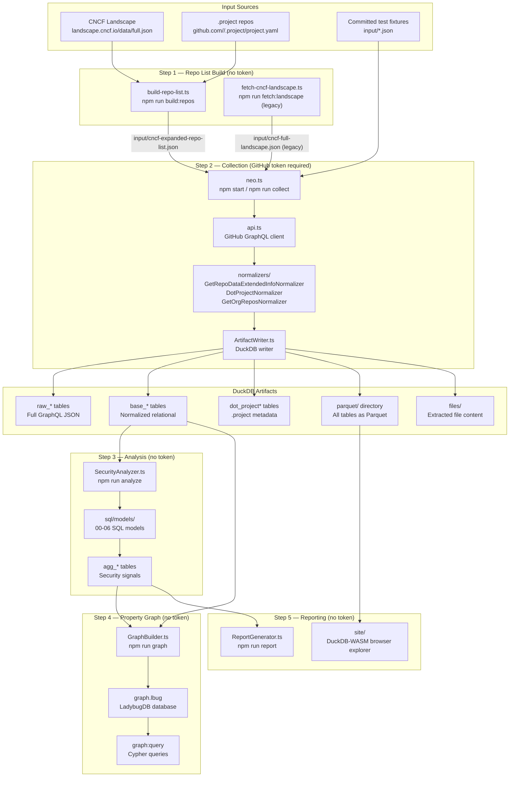

# Supply Chain Security Collector — Engineering Primer

**Purpose:** Durable internal reference for contributors and operators.  
**Scope:** Architecture, data model, pipeline stages, utility scripts, repo-list maintenance, and documentation audit.  
**Not a CNCF report** — the CNCF-facing findings live in `docs/presentations/`.

---

## Table of Contents

1. [Architecture Overview](#1-architecture-overview)
2. [End-to-End Pipeline](#2-end-to-end-pipeline)
3. [Full Data Model](#3-full-data-model)
4. [Utility Scripts and Repo-List Maintenance](#4-utility-scripts-and-repo-list-maintenance)
5. [Graph Layer (LadybugDB)](#5-graph-layer-ladybugdb)
6. [Documentation Audit](#6-documentation-audit)

---

## 1. Architecture Overview



### Key design decisions

- **GitHub GraphQL only** — all data is collected through one API endpoint. Limitations: no OCI registry, no package manager provenance, no non-GitHub CI. Every number is a lower bound.
- **DuckDB as the hub** — raw JSON → base tables → agg tables all live in a single `database.db`. Parquet exports allow any downstream tool to consume the data.
- **No state between runs** — each `npm start` produces a fresh timestamped directory under `output/`. A `current` symlink tracks the latest.
- **Two input formats** — simple `RepositoryTarget[]` (owner/name only) or rich `ProjectMetadata[]` (generated from landscape, includes CNCF maturity, dates, audit counts). The rich format is needed for CNCF analysis tables (`base_cncf_projects`, `agg_cncf_project_summary`).

---

## 2. End-to-End Pipeline

### Stage 1 — Repo list build (`scripts/`)

| Script | npm alias | Source of truth | Output |
|--------|-----------|-----------------|--------|
| `build-repo-list.ts` | `npm run build:repos` | `landscape.cncf.io/data/full.json` + per-org `.project/project.yaml` | `input/cncf-expanded-repo-list.json` |
| `fetch-cncf-landscape.ts` | `npm run fetch:landscape` | `raw.githubusercontent.com/cncf/landscape/master/landscape.yml` | `input/cncf-full-landscape.json` (legacy) |

**`build-repo-list.ts` is the current recommended path.** It UNIONs two sources:
1. `full.json` — the CNCF landscape REST endpoint (machine-readable JSON, 239+ projects).
2. Per-org `.project` repos — raw HTTPS fetches to `raw.githubusercontent.com/<org>/.project/main/project.yaml`, adding repos not captured by the landscape.

Each entry carries a `source` field: `"landscape"` | `"dot-project"` | `"both"`. Deduplication is on `owner/name` (case-insensitive).

**`fetch-cncf-landscape.ts` (legacy)** fetches `landscape.yml` from the CNCF GitHub repo directly and produces `cncf-full-landscape.json`. It remains functional but does not add `.project` enrichment. The `npm start` script still points to `cncf-full-landscape.json` for backward compatibility.

### Stage 2 — Collection (`src/neo.ts`)

Entry point: `ts-node src/neo.ts` (aliased as `npm start` / `npm run landscape` / `npm run collect`).

**Key CLI flags:**

| Flag | Default | Effect |
|------|---------|--------|
| `--input <file>` | required | Path to input JSON |
| `--queries <name>` | `GetRepoDataExtendedInfo` | GraphQL query to run |
| `--parallel` | false | Batch size 5, 1 s delay between batches |
| `--analyze` | false | Run SQL analysis after collection |
| `--maturity <levels>` | (all) | Filter by `graduated`, `incubating`, `sandbox`, `archived` |
| `--repo-scope <scope>` | `primary` | `primary` = only `primary: true` repos; `all` = every repo |
| `--scan-orgs` | false | Discover all repos across orgs in input (populates `base_org_repos`) |
| `--dot-project` | false | Fetch `<org>/.project/project.yaml` via GraphQL for all orgs scanned, write `dot_project*` tables |

**Collection flow per repo:**
1. `createApiClient()` — GraphQL client with Bearer token.
2. `fetchRepositoryExtendedInfo()` — fires `GetRepoDataExtendedInfo` query, handles rate limits.
3. Raw response appended to `raw-responses.GetRepoDataExtendedInfo.jsonl`.
4. `writeArtifacts()` — normalizes and writes to DuckDB.

**Files extracted per repo** (written to `files/` when `--persist-files` is true, which is the default):
- `.github/workflows/*.yml` — all workflow files (content stored in `base_workflows`)
- `SECURITY.md` (or `.github/SECURITY.md`) — content stored in `base_security_md`
- `SECURITY-INSIGHTS.yml` / `security-insights.yml` (root or `.github/`) — parsed as YAML, stored as JSON in `base_si_documents`

**GraphQL files fetched per repo** (via `object(expression: "HEAD:<path>") { ... on Blob { text } }`):
- `HEAD:SECURITY.md`
- `HEAD:.github/dependabot.yml`
- `HEAD:.github/workflows` (Tree, then entries as Blobs)
- `HEAD:SECURITY-INSIGHTS.yml`, `HEAD:security-insights.yml`, `HEAD:.github/SECURITY-INSIGHTS.yml`, `HEAD:.github/security-insights.yml` (all four variants checked)

### Stage 3 — Analysis (`src/SecurityAnalyzer.ts`)

Triggered by `--analyze` flag or `npm run analyze`. Runs SQL models in order:

| Model | Creates | Description |
|-------|---------|-------------|
| `00_initialize_indexes.sql` | FTS index on `base_workflows` | BM25 full-text search index for workflow content |
| `01_artifact_analysis.sql` | `agg_artifact_patterns` | Classifies release assets (SBOM, signature, attestation, VEX, SLSA, etc.) |
| `01a_security_insights_flattener.sql` | `base_si_sboms`, `agg_si_attestations` | Flattens Security Insights YAML JSON into rows |
| `02_workflow_tool_detection.sql` | `agg_workflow_tools` | Detects security tools in workflows via FTS BM25 |
| `03_repository_security_summary.sql` | `agg_repo_summary` | Repo-level rollup of all security signals |
| `04_summary_views.sql` | `agg_executive_summary`, `agg_tool_summary`, `agg_repo_summary_sorted`, `agg_sbom_summary`, `agg_advanced_artifacts`, `agg_tool_category_summary`, `agg_repo_detail` | Summary and view tables |
| `05_cncf_project_analysis.sql` | `agg_cncf_project_summary` | CNCF project-level rollup (requires rich input format) |
| `06_org_ci_visibility.sql` | org-level CI visibility | Requires `--scan-orgs` data |

After analysis, `agg_*` tables are exported to `parquet/`, and two CSV files are exported:
- `security-insights-sboms.csv`
- `security-insights-attestations.csv`

### Stage 4 — Graph (`src/graph/`)

`npm run graph -- --database <path>` builds a LadybugDB property graph from the DuckDB.

**Node tables:** `Repository`, `Release`, `ReleaseAsset`, `Workflow`, `CNCFProject`, `Tool`, `ToolCategory`

**Relationship tables:** `HAS_RELEASE`, `HAS_ASSET`, `HAS_WORKFLOW`, `BELONGS_TO`, `USES_TOOL`, `IN_CATEGORY`

**Built-in Cypher queries** (`npm run graph:list`):
- `graduated-no-signing` — graduated projects with no signing tools in any workflow
- `tool-cooccurrence` — tool co-occurrence across workflow files
- `full-pipeline` — repos with SBOM assets + cosign/sigstore in workflows
- `maturity-tool-adoption` — tool category adoption by CNCF maturity level
- `project-tool-summary` — all tools used by each CNCF project
- `repos-by-tool` — repositories using a specific tool
- `unmonitored-graduated` — graduated projects with no detected CI security tools at all

### Stage 5 — Reporting

- `npm run report -- --database <path>` — Markdown report via `ReportGenerator.ts`
- `site/` — DuckDB-WASM browser explorer ([live](https://halcyondude.github.io/supply-chain-security-collector/)), pre-loaded with committed Parquet data

---

## 3. Full Data Model

### Layer overview

| Prefix | Source | Description |
|--------|--------|-------------|
| `raw_*` | `ArtifactWriter.ts` | Full GraphQL JSON via `read_json()`, maximum nesting depth preserved |
| `base_*` | TypeScript normalizers + `ArtifactWriter.ts` | Flat relational entities with FKs |
| `dot_project*` | `DotProjectNormalizer.ts` + `ArtifactWriter.ts` | `.project` metadata (no `base_` prefix) |
| `agg_*` | `sql/models/` SQL | Analysis results and rollups |

### `raw_*` tables

| Table | Populated by | Description |
|-------|-------------|-------------|
| `raw_GetRepoDataExtendedInfo` | `ArtifactWriter.ts` | One column per GraphQL field (auto-detected), nested structs preserved as JSON |

### `base_*` tables (collection layer)

| Table | Normalizer / Source | Key columns |
|-------|--------------------|-----------  |
| `base_repositories` | `GetRepoDataExtendedInfoNormalizer` | `id` (PK), `nameWithOwner`, `url`, `description`, `hasVulnerabilityAlertsEnabled`, `license_key/name/spdxId`, `defaultBranch_name` |
| `base_branch_protection_rules` | `GetRepoDataExtendedInfoNormalizer` | `id` (generated), `repository_id` (FK), `allowsDeletions`, `allowsForcePushes`, `requiresStatusChecks`, `requiresCodeOwnerReviews`, `pattern`, `isDefaultBranch` |
| `base_releases` | `GetRepoDataExtendedInfoNormalizer` | `id` (PK), `repository_id` (FK), `name`, `tagName`, `url`, `createdAt` |
| `base_release_assets` | `GetRepoDataExtendedInfoNormalizer` | `id` (PK), `release_id` (FK), `name`, `downloadUrl` |
| `base_workflows` | `GetRepoDataExtendedInfoNormalizer` | `id` (generated: `{repo_id}_{filename}`), `repository_id` (FK), `filename`, `content` (full YAML text) |
| `base_security_md` | `GetRepoDataExtendedInfoNormalizer` | `id` (generated), `repository_id` (FK), `path`, `content` |
| `base_si_documents` | `ArtifactWriter.ts` (inline) | `repo_id` + `source_url` (PK composite), `schema_version`, `document` (JSON blob), `fetched_at` |
| `base_si_sboms` | `01a_security_insights_flattener.sql` | Rows extracted from `document` JSON; one row per SBOM entry declared in security-insights |
| `base_cncf_projects` | `ArtifactWriter.createCNCFTables()` | One row per CNCF project; rich-format input only. 35+ columns including maturity dates, audit metadata, URLs |
| `base_cncf_project_repos` | `ArtifactWriter.createCNCFTables()` | Junction: `project_name` + `owner` + `name` + `primary` + `branch` |
| `base_org_repos` | `ArtifactWriter.writeOrgRepoArtifacts()` | One row per repo discovered via `--scan-orgs`; `cncf_project_name` FK |

### `dot_project*` tables (`.project` metadata)

Added by `--dot-project` flag; written by `ArtifactWriter.writeDotProjectArtifacts()` using `DotProjectNormalizer.parseDotProject()`.

| Table | PK / FK | Key columns |
|-------|---------|-------------|
| `dot_project` | `org` (PK) | `source_url`, `schema_version`, `slug`, `name`, `type`, `project_lead`, `repository_count`, `website`, `current_maturity`, `current_maturity_date`, `audit_count`, `security_policy_path`, `security_threat_model_path`, `security_contact_email`, `security_advisory_url`, `landscape_category/subcategory`, `package_managers_json`, `fetched_at` |
| `dot_project_repositories` | `org` + `position` | `repo_url`, `repo_owner`, `repo_name` — one row per URL in `repositories[]` |
| `dot_project_maturity_log` | `org` + `position` | `phase`, `date`, `issue` — one row per `maturity_log[]` entry |
| `dot_project_audits` | `org` + `position` | `date`, `type`, `url` — one row per `audits[]` entry |

**Source schema:** `github.com/<org>/.project` → `project.yaml`. Reference schema at `~/gh/f/cncf/automation/utilities/dot-project/SCHEMA.md`.

### `agg_*` tables (analysis layer)

| Table | SQL model | Description |
|-------|-----------|-------------|
| `agg_artifact_patterns` | `01_artifact_analysis.sql` | One row per release asset classification: `is_sbom`, `sbom_format`, `is_signature`, `is_attestation`, `is_vex`, `is_slsa_provenance`, `is_in_toto_*`, `is_sigstore_bundle`, `is_container_attestation`, `is_license_file` |
| `agg_workflow_tools` | `02_workflow_tool_detection.sql` | One row per tool detection: `workflow_id`, `repository_id`, `nameWithOwner`, `workflow_name`, `tool_category`, `tool_name`. Categories: `sbom-generator`, `signer`, `goreleaser`, `vulnerability-scanner`, `dependency-scanner`, `code-scanner`, `container-scanner` |
| `agg_repo_summary` | `03_repository_security_summary.sql` | One row per repo: aggregated booleans for every signal (has_sbom_artifact, uses_cosign, uses_codeql, etc.), counts, dates |
| `agg_executive_summary` | `04_summary_views.sql` | Single-row overall statistics |
| `agg_tool_summary` | `04_summary_views.sql` | One row per detected tool with repo count and adoption % |
| `agg_repo_summary_sorted` | `04_summary_views.sql` | Pre-sorted repo list for reports |
| `agg_sbom_summary` | `04_summary_views.sql` | SBOM format counts (SPDX, CycloneDX, unknown) |
| `agg_advanced_artifacts` | `04_summary_views.sql` | Counts for VEX, SLSA, in-toto, sigstore bundles, SWID tags |
| `agg_tool_category_summary` | `04_summary_views.sql` | Tools grouped by category |
| `agg_repo_detail` | `04_summary_views.sql` | Pre-sorted detailed repo metrics |
| `agg_si_attestations` | `01a_security_insights_flattener.sql` | Flattened attestations from security-insights.yml |
| `agg_cncf_project_summary` | `05_cncf_project_analysis.sql` | 60+ column CNCF project rollup; rich-format only |

### Entity-relationship summary

```
base_cncf_projects ─── base_cncf_project_repos ──┐
                                                   ↓
base_repositories ─── base_releases ─── base_release_assets
      │
      ├─── base_workflows         (→ agg_workflow_tools via FTS)
      ├─── base_branch_protection_rules
      ├─── base_security_md
      └─── base_si_documents ──── base_si_sboms
                              └── agg_si_attestations

dot_project ─── dot_project_repositories
           ├─── dot_project_maturity_log
           └─── dot_project_audits

base_org_repos  (standalone; org-level discovery via --scan-orgs)
```

---

## 4. Utility Scripts and Repo-List Maintenance

### All scripts inventory

| Script | Location | npm alias | Purpose |
|--------|----------|-----------|---------|
| `build-repo-list.ts` | `scripts/` | `npm run build:repos` | **Primary repo-list builder.** Fetches `full.json` + `.project` repos, deduplicates, writes `input/cncf-expanded-repo-list.json` |
| `fetch-cncf-landscape.ts` | `scripts/` | `npm run fetch:landscape` | **Legacy.** Fetches `landscape.yml` from GitHub raw, produces `input/cncf-full-landscape.json` (no `.project` enrichment) |
| `ensure-env.sh` | `scripts/` | (manual) | Checks required env vars before a run |
| `run-cncf-all.sh` | `scripts/` | (manual) | Shell convenience wrapper for a full landscape collect run |
| `run-target.sh` | `scripts/` | (manual) | Run collector against a specific target |
| `test-dot-project-duckdb.ts` | `scripts/` | (manual) | End-to-end validation of `.project` → DuckDB write |
| `test-dot-project-parse.ts` | `scripts/` | (manual) | Unit test for `DotProjectNormalizer` without network or token |
| `view-parquet.sh` | `scripts/` | (manual) | Shell helper to view Parquet files via DuckDB CLI |
| `wget-clomonitor-data.sh` | `scripts/` | (manual) | Download CLOMonitor JSON data (input for analysis; not wired into main pipeline) |
| `fetch-cncf-landscape-old.ts` | `scripts/` | (dead) | Superseded by `fetch-cncf-landscape.ts` — safe to delete |

### Repo-list refresh: canonical recipe

**When to refresh:** CNCF adds/removes projects and changes maturity levels continuously. The committed `input/cncf-full-landscape.json` was last updated **2026-02-02** (commit `1011f44`). As of 2026-07-17, this file is approximately **5.5 months stale** — new projects, maturity promotions, and archived projects since February will not be captured.

**The recommended command:**

```bash
# Step 1a: Refresh repo list (no GitHub token required; GITHUB_TOKEN helps with rate limits)
npm run build:repos

# Step 1b (optional): Also refresh the legacy landscape file if needed
# npm run fetch:landscape

# Step 2: Full scan against the refreshed list (GitHub token required)
export GITHUB_PERSONAL_ACCESS_TOKEN=ghp_xxx
npx ts-node src/neo.ts \
  --input input/cncf-expanded-repo-list.json \
  --queries GetRepoDataExtendedInfo \
  --dot-project \
  --analyze \
  --parallel
```

**Flags for `build:repos`:**

```bash
npm run build:repos                                    # full build (landscape + .project)
npm run build:repos -- --no-dot-project               # landscape only, skip .project HTTP fetches
npm run build:repos -- --output input/custom.json     # custom output path
npm run build:repos -- --dry-run                      # print counts, write nothing
npm run build:repos -- --verbose                      # log each .project repo found
GITHUB_TOKEN=ghp_xxx npm run build:repos              # with token for rate limit headroom
```

**Source of truth per script:**

| Script | Landscape source | .project source |
|--------|-----------------|-----------------|
| `build-repo-list.ts` | `https://landscape.cncf.io/data/full.json` (.items[] array) | `https://raw.githubusercontent.com/<org>/.project/main/project.yaml` |
| `fetch-cncf-landscape.ts` | `https://raw.githubusercontent.com/cncf/landscape/master/landscape.yml` | N/A |
| `--dot-project` flag (neo.ts) | N/A (uses already-built repo list) | GitHub GraphQL `object(expression: "HEAD:project.yaml")` |

**Critical note on dead endpoints:**  
`https://landscape.cncf.io/data/items.json` now returns HTML (the landscape2 SPA shell). `build-repo-list.ts` explicitly guards against this with a content-type check and a clear error message. Do not use `items.json`.

**Staleness assessment (as of 2026-07-17):**

| File | Last refreshed | Age | Assessment |
|------|---------------|-----|------------|
| `input/cncf-full-landscape.json` | 2026-02-02 (commit `1011f44`) | ~5.5 months | **STALE** — run `npm run build:repos` |
| `input/cncf-expanded-repo-list.json` | Not committed | N/A | Regenerated locally; not tracked in git |
| `input/test-*.json` | 2026-02-02 | ~5.5 months | Acceptable for testing; refresh when test projects change significantly |

**What `.project` adds vs. landscape alone:**  
As of the April 2026 run, ~61 of 251 CNCF orgs had a `.project` repo. The `build:repos` script adds repos listed in `repositories[]` of each `project.yaml` that are not already in the landscape — these are often satellite repos (e.g., website, docs, sub-projects) that the landscape tracks as non-primary or omits entirely.

### The `--scan-orgs` flag (separate concern)

`--scan-orgs` is a **runtime** flag on `neo.ts`, not a repo-list utility. When passed, it discovers all repos under each org found in the input data via the GitHub GraphQL `GetOrgRepos` query (paginated). Results land in `base_org_repos`. This is distinct from `build:repos` — it runs during the scan, not before it, and requires a GitHub token.

---

## 5. Graph Layer (LadybugDB)

The graph step is optional but powerful for cross-entity traversal queries.

**Build:**
```bash
npm run graph -- --database output/cncf-expanded-repo-list/current/database.db
# Produces: output/cncf-expanded-repo-list/current/graph.lbug
```

**Graph schema:**
- Node tables: `Repository`, `Release`, `ReleaseAsset`, `Workflow`, `CNCFProject`, `Tool`, `ToolCategory`
- Sources: `base_repositories`, `base_releases`, `base_release_assets`, `base_workflows`, `base_cncf_projects`, `agg_workflow_tools`
- `Tool` and `ToolCategory` nodes only exist if `agg_workflow_tools` was populated (requires `--analyze` in the collect step)

**Query:**
```bash
npm run graph:list                                             # list all built-in queries
npm run graph:query -- --graph <path> --name graduated-no-signing
npm run graph:query -- --graph <path> --cypher "MATCH (p:CNCFProject)<-[:BELONGS_TO]-(r:Repository) RETURN p.display_name, count(r) AS repos ORDER BY repos DESC LIMIT 10"
npm run graph:query -- --graph <path> --file cypher/tool-cooccurrence.cypher
```

**Standalone Cypher files** in `cypher/`:
- `graduated-no-signing.cypher`
- `maturity-tool-adoption.cypher`
- `tool-cooccurrence.cypher`

**Important:** LadybugDB (`lbug` npm package) uses a directory-based storage format. `npm run graph` removes and recreates `graph.lbug` on each invocation.

---

## 6. Documentation Audit

### Full inventory with recommendations

| Document | Path | Status | Recommendation | Reason |
|----------|------|--------|----------------|--------|
| README.md | `/README.md` | Current | **Keep** | Accurate overview, quick-start, script table, architecture summary. Primary entry point. |
| RUNBOOK.md | `/RUNBOOK.md` | Current | **Keep** | Best operator reference. Full 5-step pipeline with commands, token table, troubleshooting. Complements this PRIMER. |
| PRIMER.md | `/docs/PRIMER.md` | New | **Keep** | This document. Durable engineering reference. |
| data-model.md | `docs/data-model.md` | Current | **Keep** | Full table schema reference. Should be updated when new tables are added. Covers `dot_project*` tables. |
| output-architecture.md | `docs/output-architecture.md` | Current | **Keep** | Good reference for output directory structure and Parquet export strategy. Could merge into PRIMER later. |
| detection-reference.md | `docs/detection-reference.md` | Current | **Keep** | Canonical catalog of patterns (FTS keywords, REGEXP). Useful for contributors adding new detections. |
| adding-new-queries.md | `docs/adding-new-queries.md` | Current | **Keep** | Developer how-to for extending the GraphQL query layer. Accurate 5-step workflow. |
| codegen-guide.md | `docs/codegen-guide.md` | Current | **Keep** | Explains `npm run codegen` / `graphql-codegen` setup. Useful when adding new `.graphql` files. |
| docs/background/README.md | `docs/background/README.md` | Dated | **Keep (low priority)** | Index to architecture and decisions docs. Not actively maintained but not misleading. |
| architecture.md | `docs/background/architecture.md` | Dated | **Prune or merge** | Superseded by README and this PRIMER. May describe an older pipeline. Verify before deleting. |
| decisions.md | `docs/background/decisions.md` | Dated | **Keep** | ADR-style rationale (DuckDB choice, Parquet export, etc.). Historical context; not operational. |
| duckdb-extensions-strategy.md | `docs/background/duckdb-extensions-strategy.md` | Dated | **Keep** | Rationale for extension install pattern. Useful if the extension strategy changes. |
| PROJECT-HISTORY.md | `docs/PROJECT-HISTORY.md` | Archival | **Keep (archive)** | Annotated timeline with Mermaid gantt chart. Good historical record; not operational. |
| project-status-2026-04-27.md | `docs/project-status-2026-04-27.md` | **Stale** | **Prune** | Point-in-time snapshot from April 2026. Content absorbed by README and PROJECT-HISTORY. No new information. |
| docs/milestones/README.md | `docs/milestones/README.md` | Archival | **Keep (archive)** | Index of milestone planning docs. Historical. |
| docs/milestones/001–007.md | `docs/milestones/*.md` | Archival | **Keep (archive)** | Planning artifacts for milestones 1–7. Not operational; useful for understanding why decisions were made. |
| docs/presentations/2026-04-08-tag-sc/ | `docs/presentations/` | Archival | **Keep (archive)** | CNCF TAG Security presentation materials. Reference documents, findings reports, strategy docs. Matt's domain. |
| docs/superpowers/ | `docs/superpowers/plans/` | **Stale** | **Prune** | `2026-03-30-parallel-workstreams.md` — planning artifact for a sprint that completed. No ongoing operational value. |
| sql/README.md | `sql/README.md` | Current | **Keep** | Documents the SQL model architecture and numbered execution order. |
| AGENTS.md | `/AGENTS.md` | Meta | **Keep** | Agent instructions. Not engineering documentation. |
| CLAUDE.md | `/CLAUDE.md` | Meta | **Keep** | Claude Code instructions. Not engineering documentation. |

### Pruning candidates summary

Files recommended for removal (not deletion yet — review before pruning):

1. **`docs/project-status-2026-04-27.md`** — pure point-in-time snapshot, fully superseded by README + PROJECT-HISTORY.
2. **`docs/superpowers/plans/2026-03-30-parallel-workstreams.md`** — completed sprint planning artifact.
3. **`scripts/fetch-cncf-landscape-old.ts`** — explicitly named "old", superseded by `fetch-cncf-landscape.ts`.

Files recommended for merge (consider in a future cleanup):

1. **`docs/background/architecture.md`** — verify content vs. README; if superseded, merge any non-redundant context into PRIMER or delete.
2. **`docs/output-architecture.md`** — good but overlaps significantly with the RUNBOOK and README output structure sections. Could be absorbed into PRIMER §2 and RUNBOOK §2.
