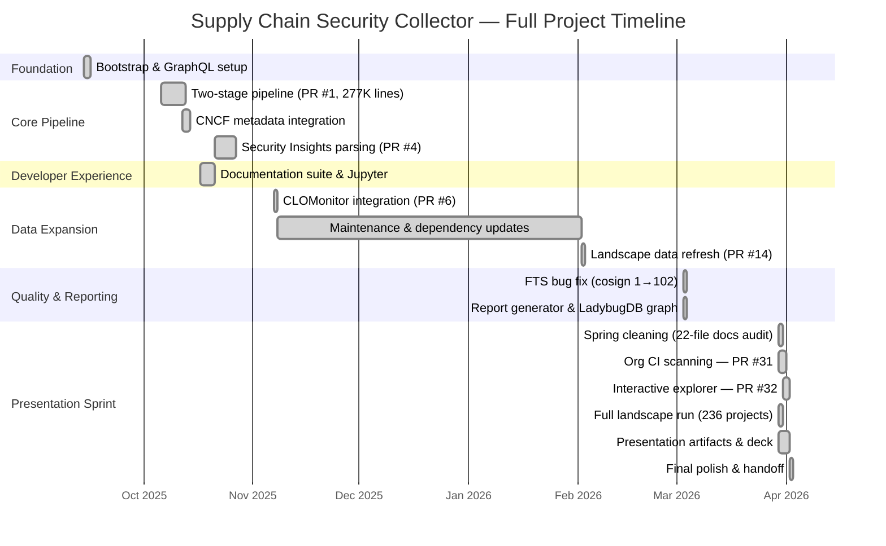

# Project History: Supply Chain Security Collector

## Executive Summary

The supply-chain-security-collector was built over 6.5 months (September 2025 – April 2026) to answer a question nobody in the CNCF ecosystem could answer quantitatively: across all ~236 projects, who is actually shipping SBOMs, signing releases, and running security tools in CI? Starting from a GraphQL bootstrap, it evolved through a core two-stage pipeline, CNCF landscape integration, a quality and reporting milestone, and culminated in an interactive browser-based exploration platform for the April 2026 TAG Security presentation. The tool now covers 236 CNCF projects (4,169 releases, 39,304 assets, 2,784 workflows) and found that 16.1% of projects ship SBOMs, 15.3% have signatures, and only 1.7% include attestations — all as observed via GitHub release assets, establishing lower bounds on actual adoption.

## Timeline



## Phase Breakdown

| Phase | Dates | Key PRs | What Shipped |
|-------|-------|---------|--------------|
| **Bootstrap** | Sep 14, 2025 | — | GraphQL schema, TypeScript codegen, CLI scaffold, 8 mock repos |
| **Core Pipeline** | Oct 6–13, 2025 | PR #1 (277K add, 90 files) | Two-stage architecture: collection → normalization → DuckDB + Parquet. Typed normalizers, rate-limited GraphQL client. |
| **Security Features** | Oct 21–27, 2025 | PR #4 (10K add, 24 files) | SECURITY-INSIGHTS.yml parsing, security document detection, column alignment |
| **DevEx & Docs** | Oct 17–20, 2025 | — | Jupyter Lab integration, documentation suite, `npm run clean` |
| **CNCF Integration** | Nov 7, 2025 | PR #6 (9K add, 9 files) | CLOMonitor data files, landscape fetch script |
| **Maintenance** | Nov 2025 – Feb 2026 | PR #14, 6 Dependabot PRs | Dependency updates, landscape data refresh, GraphQL node IDs |
| **Quality & Reporting** | Mar 3, 2026 | PR #27 (11K add, 25 files) | FTS index bug fix (cosign: 1→102), `ReportGenerator.ts`, LadybugDB property graph, agg_* Parquet export, lint cleanup (6→0 errors) |
| **Presentation Sprint** | Mar 30 – Apr 2, 2026 | PR #31, PR #32 | Org CI scanning (`--scan-orgs`), DuckDB-WASM interactive explorer, GitHub Pages deployment, 22-file docs audit, full landscape run, 12-slide deck, 5 SVG diagrams, findings report, GUAC strategy |

## Key Findings (Full CNCF Landscape)

Every number is a **lower bound** — absence of evidence ≠ evidence of absence. These reflect what is observable via GitHub release assets and workflow files.

| Metric | Value |
|--------|-------|
| Projects scanned | 236 |
| Releases analyzed | 4,169 |
| Release assets checked | 39,304 |
| Workflows analyzed | 2,784 |
| SBOM adoption (in releases) | 16.1% |
| Signature adoption (in releases) | 15.3% |
| Both SBOM + signatures | 5.9% |
| Attestations | 1.7% |
| Cosign referenced in CI | 0.4% (1 repo) |
| CodeQL adoption | 33.9% |
| Any artifacts (Tier 1) | 28.4% |

**Counterintuitive finding:** Incubating projects outperform graduated projects on both SBOM and signature adoption rates, suggesting newer projects adopt modern practices earlier.

## Contributors

| Actor | Role | Contributions |
|-------|------|---------------|
| **halcyondude** | Creator, all feature development | 4 issues, 7 PRs, all architecture decisions |
| **Dependabot** | Automated dependency management | 17 PRs (12 merged, 5 superseded) |
| **Claude** | Code review, docs, presentation strategy | Milestone docs, 3-panel presentation workshops, exploration platform design |

## Architecture

```
Input JSON → GitHub GraphQL API → Typed Normalizers → DuckDB base_* tables + Parquet
                                                          ↓
                                              SQL Models (00–05) → agg_* tables
                                                          ↓
                                          ┌───────────────┼───────────────┐
                                    Markdown Report    LadybugDB       Explorer
                                    (ReportGenerator)  (Cypher)     (DuckDB-WASM)
```

## What's Next

| Priority | Item |
|----------|------|
| Immediate | Deploy exploration site to GitHub Pages |
| Short-term | Re-run landscape with `--scan-orgs` for org coverage data |
| Short-term | GitHub Attestations API integration (`actions/attest-build-provenance`) |
| Medium-term | OCI registry scanning (container image signatures via cosign/crane) |
| Medium-term | GUAC integration — Path 1: download identified SBOMs, feed to GUAC, join in DuckDB |
| Long-term | TAG Security proposal — contribute methodology + dataset as recurring landscape assessment |
