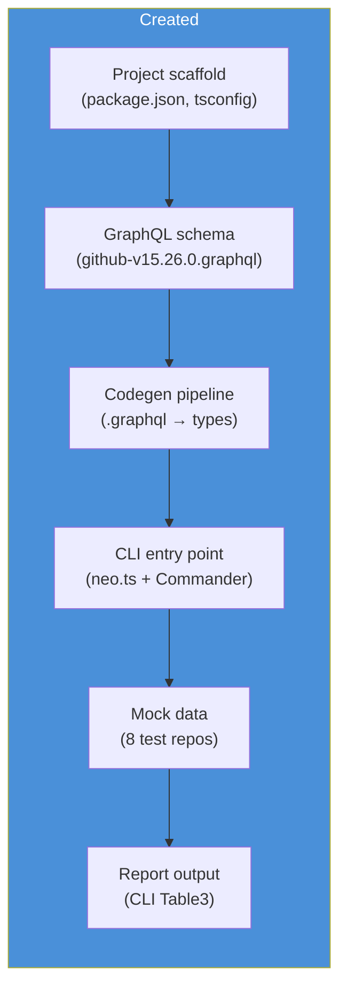

# Milestone 1: Bootstrap & GraphQL Foundation

**Date:** September 14-15, 2025
**Commits:** 25 (`f28b427` through `574203c`)

## Summary

Project created from scratch: GitHub GraphQL schema download, CLI scaffolding with Commander.js, mocked repository data for development, and initial report generation using console tables. TypeScript codegen wired up to auto-generate types from `.graphql` query files.

## What Was Built

## Key Decisions

| Decision | Rationale |
|----------|-----------|
| TypeScript + GraphQL Codegen | Type-safe API access with compile-time verification |
| Commander.js for CLI | Standard Node.js CLI framework, good help generation |
| DuckDB for storage | In-process analytical SQL, no server needed |
| Parquet for export | Columnar, compressed, cross-language portability |
| Chalk for output | Readable console output with color-coded status |

## Files Created

- `src/neo.ts` — Main CLI entry point
- `src/api.ts` — GraphQL client with GitHub PAT auth
- `src/report.ts` — Console table report formatting
- `codegen.ts` — GraphQL Code Generator configuration
- `schema/github-v15.26.0.graphql` — GitHub API schema (local copy)
- `src/graphql/GetRepoDataArtifacts.graphql` — First GraphQL query
- Mock data fixtures for 8 test repositories

## Test Repositories

kubernetes, harbor, atlantis, flux2, kubescape, cert-manager, argo-cd, containerd

## Verification

- `npm run codegen` — Generates TypeScript types from `.graphql` files
- Basic CLI runs with mock data and produces console table output
