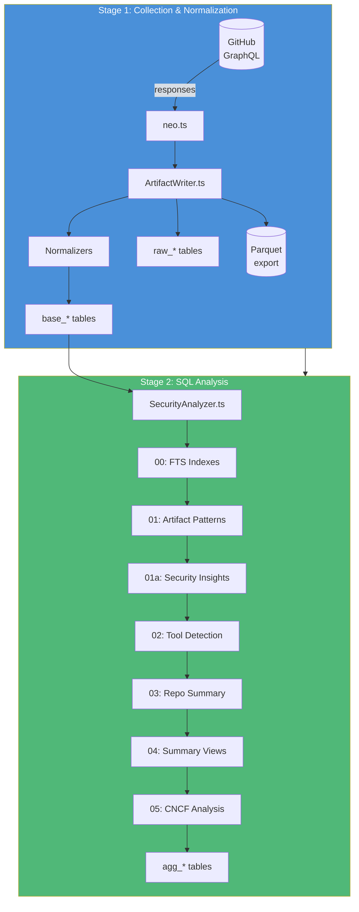
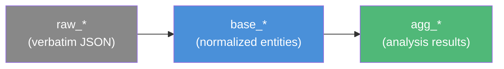

# Milestone 2: Two-Stage Pipeline Architecture

**Date:** October 6-12, 2025
**Commits:** ~15 (`88a32d8` through `52f0df5`)

## Summary

The most significant architectural transformation. Replaced ad-hoc data handling with a clean two-stage pipeline: **Collection & Normalization** (GraphQL to DuckDB) followed by **SQL-based Analysis** (SQL models producing aggregation tables). Introduced the table naming convention (`raw_*` / `base_*` / `agg_*`), full-text search for tool detection, and the normalizer pattern.

## Architecture



## Table Naming Convention



| Prefix | Purpose | Examples |
|--------|---------|---------|
| `raw_*` | Verbatim GraphQL JSON | `raw_GetRepoDataExtendedInfo` |
| `base_*` | Normalized relational entities | `base_repositories`, `base_releases`, `base_workflows` |
| `agg_*` | Analysis/aggregation results | `agg_workflow_tools`, `agg_repo_summary` |

## SQL Analysis Models

| Model | File | Creates | Depends On |
|-------|------|---------|------------|
| 00 | `00_initialize_indexes.sql` | FTS + B-tree indexes | `base_*` tables |
| 01 | `01_artifact_analysis.sql` | `agg_artifact_patterns` | `base_release_assets` |
| 01a | `01a_security_insights_flattener.sql` | `agg_si_attestations`, `base_si_sboms` | `base_si_documents` |
| 02 | `02_workflow_tool_detection.sql` | `agg_workflow_tools` | `base_workflows` + FTS |
| 03 | `03_repository_security_summary.sql` | `agg_repo_summary` | `agg_artifact_patterns`, `agg_workflow_tools` |
| 04 | `04_summary_views.sql` | 6 summary tables | `agg_repo_summary`, `agg_workflow_tools` |
| 05 | `05_cncf_project_analysis.sql` | `agg_cncf_project_summary` | `base_cncf_*`, `agg_repo_summary` |

## Key Design Decisions

| Decision | Rationale |
|----------|-----------|
| Separate Collection & Analysis stages | Can re-analyze without re-fetching from GitHub |
| SQL files for analysis models | Declarative, testable, versionable, no TypeScript coupling |
| Sequential numbered models | Explicit dependency ordering (00 before 01 before 02...) |
| Hand-written normalizers | Generated types inform shape, but extraction logic needs human judgment |
| FTS for tool detection | Index-backed keyword search across thousands of YAML files |
| Apache Arrow IPC for data loading | Binary protocol, faster than JSON temp files |

## Normalizer Pattern

Each GraphQL query gets a dedicated normalizer that transforms nested API responses into flat relational tables:

```
.graphql file → codegen → TypeScript types → normalizer → base_* tables
```

- `GetRepoDataExtendedInfoNormalizer.ts` — Extracts repos, releases, assets, workflows, branch protection
- `GetRepoDataArtifactsNormalizer.ts` — Legacy query normalizer (kept for compatibility)

## Output Structure

```
output/<input-name>-<timestamp>/
├── raw-responses.<QueryName>.jsonl   # Audit trail
└── <QueryName>/
    ├── database.db                   # DuckDB database
    ├── files/                        # Persisted workflow YAML, SECURITY.md
    └── parquet/                      # Columnar exports
        ├── raw_*.parquet
        └── base_*.parquet
```

## Verification

- `npm run test:single` — End-to-end with 1 repo
- `npm test` — 3 repos (kubernetes, harbor, atlantis)
- `npm run analyze -- --database <path>` — Re-run analysis on existing data
- `npm run analyze -- --database <path> --recreate` — Drop + rebuild agg_* tables
