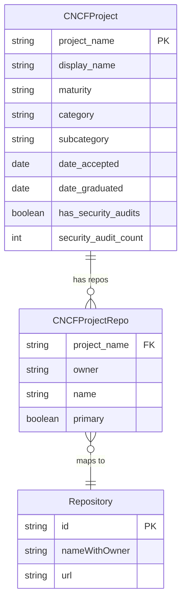
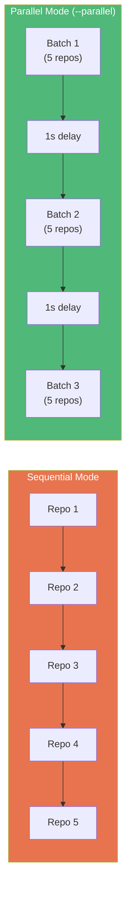

# Milestone 3: CNCF Integration & Production Scale

**Date:** October 12-13, 2025
**Commits:** 4 + PR #1

## Summary

Enabled the full CNCF landscape as an input source. Added project metadata (maturity, category, security audits), parallel execution for throughput, and the "rich" input format that carries per-project context through the pipeline. Scaled from 3 test repos to ~230 CNCF projects.

## Data Model Extension



## Input Formats

Two input formats supported — the pipeline auto-detects which is in use:

**Simple** — just owner/name pairs:
```json
[{"owner": "kubernetes", "name": "kubernetes"}]
```

**Rich** — with CNCF project metadata:
```json
[{
  "project_name": "kubernetes",
  "display_name": "Kubernetes",
  "maturity": "graduated",
  "category": "Orchestration & Management",
  "repos": [{"owner": "kubernetes", "name": "kubernetes", "primary": true}]
}]
```

## Parallel Execution



- Batch size: 5 repos per batch in parallel mode
- 1-second delay between batches (rate limiting)
- `Promise.allSettled` for fault tolerance — failures don't halt the pipeline

## Scale Achieved

| Metric | Test (3 repos) | Full Landscape |
|--------|---------------:|---------------:|
| CNCF Projects | 3 | 239 |
| Repositories | 3 | 550+ |
| Maturity: Graduated | 1 | ~30 |
| Maturity: Incubating | 1 | ~40 |
| Maturity: Sandbox | 1 | ~160 |

## New Tables

| Table | Row Count (Full) | Purpose |
|-------|----------------:|---------|
| `base_cncf_projects` | 239 | Project metadata |
| `base_cncf_project_repos` | 550+ | Project-to-repo mapping |
| `agg_cncf_project_summary` | 239 | Per-project security aggregation |

## Key Commands

```bash
# Download/update CNCF landscape metadata
npm run fetch:landscape

# Run full collection + analysis (~230 projects)
npm start

# Test with 3 projects
npm test
```
