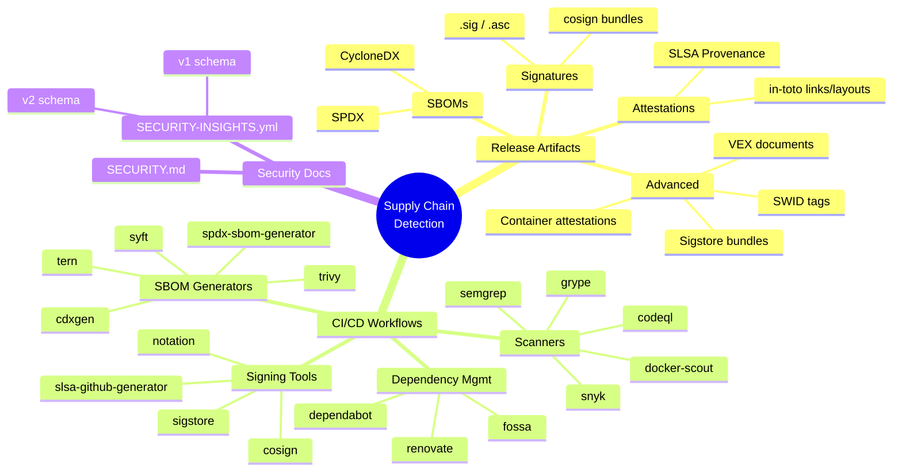
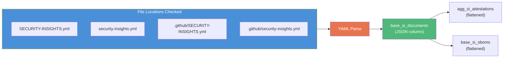

# Milestone 4: Security Features & Insights

**Date:** October 12-20, 2025
**Commits:** 8 + PR #4

## Summary

Added deep supply chain security detection: SECURITY.md extraction, SECURITY-INSIGHTS.yml parsing (both v1 and v2 schema), comprehensive CI/CD tool detection via FTS, and release artifact pattern matching for SBOMs, signatures, attestations, and advanced formats (SLSA, in-toto, VEX, Sigstore bundles).

## Detection Coverage

## Tool Detection via FTS

The `02_workflow_tool_detection.sql` model uses DuckDB Full-Text Search to scan workflow YAML content for tool signatures:

| Category | Tools Detected |
|----------|---------------|
| SBOM Generators | syft, trivy, cdxgen, spdx-sbom-generator, tern |
| Signing Tools | cosign, sigstore, slsa-github-generator, notation |
| GoReleaser | goreleaser-action |
| Vulnerability Scanners | snyk, anchore, twistlock, aqua, clair |
| Dependency Scanners | dependabot, renovate, whitesource, fossa |
| Code Scanners | codeql, semgrep, bandit, eslint-security |
| Container Scanners | docker-scout, grype, trivy |

## Artifact Pattern Matching

The `01_artifact_analysis.sql` model classifies release assets by filename patterns:

| Pattern | Detection Logic |
|---------|----------------|
| SBOM (SPDX) | Filename contains `spdx` |
| SBOM (CycloneDX) | Filename contains `cyclonedx` or `bom` |
| Signature | Extension `.sig`, `.asc`, `.sign`, or `cosign-*` prefix |
| Attestation | Filename contains `attestation`, `intoto`, or `provenance` |
| SLSA Provenance | Filename contains `slsa` and `provenance` |
| VEX | Filename contains `vex` |
| Sigstore Bundle | Extension `.sigstore` |
| License | Filename starts with `LICENSE` |

## SECURITY-INSIGHTS.yml

Support for the [OSSF Security Insights Spec](https://github.com/ossf/security-insights):

- Detects schema version (v1.x vs v2.x)
- Stores raw YAML as parsed JSON in `base_si_documents`
- Flattens attestations from nested JSON paths into `agg_si_attestations`
- Flattens SBOM declarations into `base_si_sboms`
- Exports to CSV for sharing

## Tables Created

| Table | Purpose |
|-------|---------|
| `base_security_md` | Extracted SECURITY.md content |
| `base_si_documents` | Security Insights YAML as JSON |
| `base_si_sboms` | Flattened SBOM declarations |
| `agg_si_attestations` | Flattened attestation declarations |
| `agg_artifact_patterns` | Classified release assets |
| `agg_workflow_tools` | Detected CI/CD tools per workflow |
