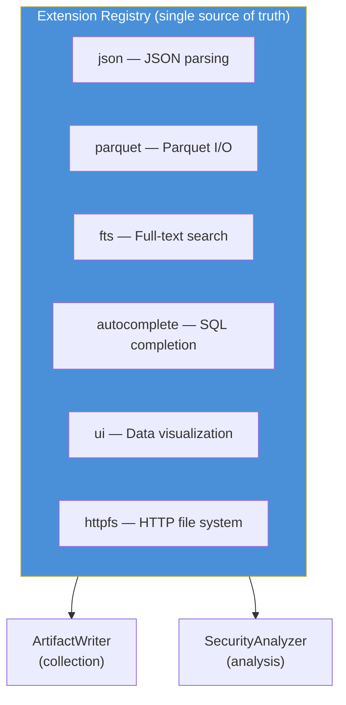
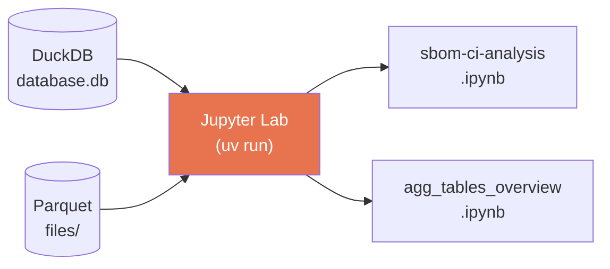

# Milestone 5: Documentation, Jupyter & CLOMonitor

**Date:** October 17 - November 7, 2025
**Commits:** ~13

## Summary

Developer experience improvements across three areas: comprehensive documentation suite, Jupyter Lab integration for interactive data exploration, and CLOMonitor data integration for CNCF compliance tracking.

## Documentation Suite

Created 8+ documentation files and the `docs/background/` architecture decision records:

| Document | Purpose |
|----------|---------|
| `CLAUDE.md` | AI assistant guidance — commands, architecture, conventions |
| `AGENTS.md` | Agent directives for autonomous operation |
| `docs/data-model.md` | Complete schema documentation |
| `docs/detection-reference.md` | 40+ KB tool detection pattern reference |
| `docs/output-architecture.md` | Output directory structure spec |
| `docs/adding-new-queries.md` | Guide for extending the query system |
| `docs/codegen-guide.md` | GraphQL codegen workflow |
| `docs/analysis-improvements.md` | Planned analysis enhancements |
| `docs/background/architecture.md` | Architecture decision record |
| `docs/background/decisions.md` | Key design decisions log |
| `docs/background/duckdb-extensions-strategy.md` | Extension management approach |

## DuckDB Extension Management

Consolidated extension loading into a single registry (`src/duckdb-extensions.ts`):



Both `ArtifactWriter` and `SecurityAnalyzer` call `installAndLoadExtensions(con)` — same registry, consistent behavior.

## Jupyter Lab Integration



- Python environment managed via `uv` (fast Python package manager)
- `pyproject.toml` with Jupyter + DuckDB Python dependencies
- Notebooks can query DuckDB directly or load Parquet files

| Command | Purpose |
|---------|---------|
| `npm run lab` | Start Jupyter Lab |
| `npm run lab:sbom-ci` | Open SBOM/CI analysis notebook |
| `npm run lab:agg-tables` | Open aggregation tables overview |

## CLOMonitor Integration

Added [CLOMonitor](https://clomonitor.io/) data for CNCF compliance scoring:

```
input/clomonitor/
├── clomonitor-cncf.yaml     # CNCF project scores
└── clomonitor-aswf.yaml     # ASWF project scores
```

- Script to fetch and refresh CLOMonitor data
- Tracks documentation, security, license, and best practices scores
- Complements GitHub-sourced data with external compliance metrics
