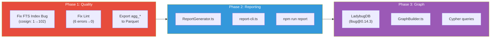
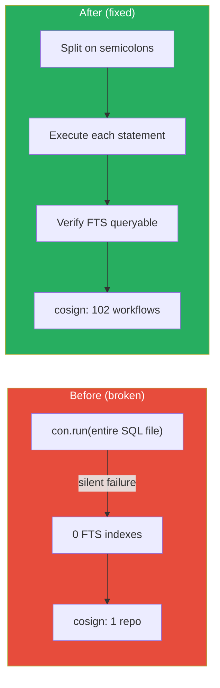
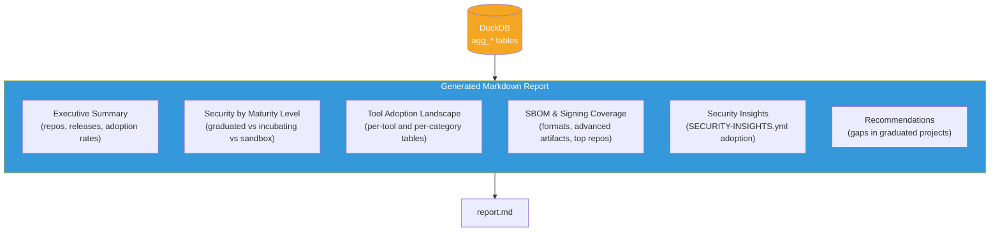
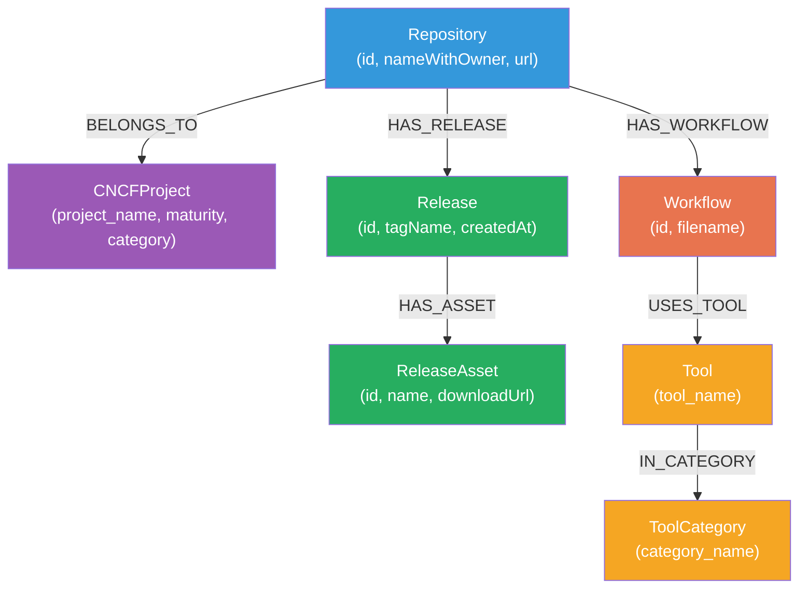
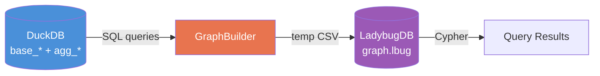
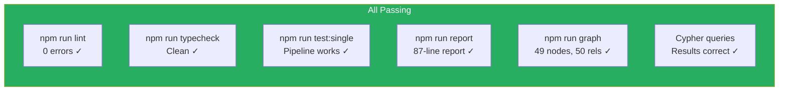

# Milestone 6: Data Quality Fixes, Reporting & Graph Database

**Date:** March 3, 2026
**Branch:** `cc-dev-polish`

## Summary

Three-part milestone addressing foundational quality issues, adding structured reporting for CNCF TOC stakeholders, and integrating LadybugDB as a property graph database for Cypher-based supply chain analysis.



---

## Phase 1: Data Quality Fixes

### 1a. FTS Index Bug — Root Cause & Fix

**Problem:** DuckDB FTS `PRAGMA` statements fail silently when executed as a batched multi-statement string via `con.run(sql)`. The entire `00_initialize_indexes.sql` file was being sent as one call. FTS indexes were never created, causing `02_workflow_tool_detection.sql` to return near-zero results.

**Proof:** Cosign detection on the full CNCF landscape — 1 repo (broken) vs 102 workflows (after fix).

**Fix applied to two files:**

`sql/models/00_initialize_indexes.sql`:
- Added `INSTALL fts; LOAD fts;` preamble

`src/SecurityAnalyzer.ts`:
- Model 00 is now split on semicolons and each statement executed individually
- Missing table errors handled gracefully per-statement (for optional tables like `base_cncf_projects`)
- FTS verification step tests that the index is actually queryable



### 1b. Lint Cleanup

| File | Issue | Fix |
|------|-------|-----|
| `src/NormalizerTools.ts` | Unused `err` catch binding | Changed to bare `catch {}` |
| `src/SecurityAnalyzer.ts` | Unused `err` catch binding | Changed to bare `catch {}` |
| `src/normalizers/GetRepoDataExtendedInfoNormalizer.ts` | Unused `processDockerfile` import | Removed import |
| `src/normalizers/GetRepoDataExtendedInfoNormalizer.ts` | Unused `extractRepoFiles` function + `RepoFile` interface + `fileConfig` | Removed (dead code) |
| `src/normalizers/GetRepoDataExtendedInfoNormalizer.ts` | Unused `_responses` param in inline function | Inlined empty array return |
| `src/ArtifactWriter.ts` | Unused `_responseMetadata` parameter | Removed parameter and call-site arg |

**Result:** 6 errors → **0 errors**, 16 warnings → **13 warnings** (all pre-existing `any` types)

### 1c. agg_* Parquet Export

**Problem:** `ArtifactWriter.ts` exports `base_*` tables to Parquet during collection, but the `agg_*` tables created by `SecurityAnalyzer` were never exported.

**Fix:** Added `exportAggTablesToParquet()` method to `SecurityAnalyzer.ts` that runs after analysis completes. Exports all `agg_*` tables to the same `parquet/` directory.

**Result:** 11 additional Parquet files now exported:

| Table | Parquet File |
|-------|-------------|
| `agg_advanced_artifacts` | `agg_advanced_artifacts.parquet` |
| `agg_artifact_patterns` | `agg_artifact_patterns.parquet` |
| `agg_executive_summary` | `agg_executive_summary.parquet` |
| `agg_repo_detail` | `agg_repo_detail.parquet` |
| `agg_repo_summary` | `agg_repo_summary.parquet` |
| `agg_repo_summary_sorted` | `agg_repo_summary_sorted.parquet` |
| `agg_sbom_summary` | `agg_sbom_summary.parquet` |
| `agg_si_attestations` | `agg_si_attestations.parquet` |
| `agg_tool_category_summary` | `agg_tool_category_summary.parquet` |
| `agg_tool_summary` | `agg_tool_summary.parquet` |
| `agg_workflow_tools` | `agg_workflow_tools.parquet` |

---

## Phase 2: Report Generator

### New Files

| File | Lines | Purpose |
|------|------:|---------|
| `src/ReportGenerator.ts` | 310 | Markdown report engine |
| `src/report-cli.ts` | 48 | CLI entry point |

### Report Structure



### Report Sections

| Section | Source Table(s) | Content |
|---------|----------------|---------|
| Executive Summary | `agg_executive_summary` | Total repos, release counts, artifact adoption percentages |
| Maturity Breakdown | `agg_cncf_project_summary` | Per-maturity tool/artifact adoption |
| Tool Adoption | `agg_tool_summary`, `agg_tool_category_summary` | Per-tool repo count, workflow count, adoption % |
| SBOM & Signing | `agg_sbom_summary`, `agg_advanced_artifacts`, `agg_repo_summary` | Format distribution, advanced artifact counts, top repos |
| Security Insights | `base_si_documents`, `agg_si_attestations`, `base_si_sboms` | Schema version breakdown, declared attestations/SBOMs |
| Recommendations | `agg_cncf_project_summary` | Graduated projects without signing/SBOMs, strong-posture leaders |

### Usage

```bash
# Print report to stdout
npm run report -- --database output/test-single-project/current/database.db

# Write to file
npm run report -- --database path/to/database.db --output reports/cncf-report.md

# Custom title
npm run report -- --database path/to/database.db --title "Q1 2026 CNCF Security Report"
```

---

## Phase 3: LadybugDB Graph Integration

### New Files

| File | Lines | Purpose |
|------|------:|---------|
| `src/graph/schema.ts` | 145 | Graph schema definition (node + rel tables) |
| `src/graph/GraphBuilder.ts` | 200 | DuckDB → LadybugDB builder |
| `src/graph/queries.ts` | 100 | 7 pre-built Cypher queries |
| `src/graph/graph-cli.ts` | 100 | CLI with build/query/list subcommands |
| `cypher/*.cypher` | 3 files | Standalone Cypher query files |

### Graph Schema



### Data Flow



1. GraphBuilder opens DuckDB read-only
2. Creates node/rel tables via Cypher DDL
3. Extracts data via SQL → writes temp CSV → `COPY ... FROM` into LadybugDB
4. Temp files cleaned up immediately

### Pre-Built Cypher Queries

| Name | Description |
|------|-------------|
| `graduated-no-signing` | Graduated projects without signing tools in any workflow |
| `tool-cooccurrence` | Which tools tend to appear together (top 20 pairs) |
| `full-pipeline` | Repos with both SBOM artifacts and cosign/sigstore in CI |
| `maturity-tool-adoption` | Tool category adoption broken down by maturity level |
| `project-tool-summary` | All tools used by each CNCF project |
| `repos-by-tool` | Repositories using a specific tool (e.g. cosign) |
| `unmonitored-graduated` | Graduated projects with zero detected CI security tools |

### Usage

```bash
# Build graph from DuckDB
npm run graph -- --database output/test-single-project/current/database.db

# Run a named query
npm run graph:query -- --graph output/test-single-project/current/graph.lbug --name project-tool-summary

# Run a .cypher file
npm run graph:query -- --graph path/to/graph.lbug --file cypher/maturity-tool-adoption.cypher

# List available queries
npm run graph:list
```

---

## Verification Results



| Check | Command | Result |
|-------|---------|--------|
| Lint | `npm run lint` | 0 errors, 13 warnings (pre-existing `any` types) |
| Typecheck | `npm run typecheck` | Clean pass |
| Pipeline | `npm run test:single` | 1 repo, 36 workflows, 5 tools detected, 11 agg_* parquet files |
| Report | `npm run report -- -d ...` | 87-line markdown report generated |
| Graph Build | `npm run graph -- -d ...` | 49 nodes, 50 relationships |
| Cypher Query | `graph:query --name project-tool-summary` | Jaeger: docker-scout, codeql, fossa |

## Files Changed

| File | Action | Category |
|------|--------|----------|
| `sql/models/00_initialize_indexes.sql` | Modified | FTS fix |
| `src/SecurityAnalyzer.ts` | Modified | FTS fix, parquet export, lint |
| `src/NormalizerTools.ts` | Modified | Lint fix |
| `src/ArtifactWriter.ts` | Modified | Lint fix |
| `src/normalizers/GetRepoDataExtendedInfoNormalizer.ts` | Modified | Lint fix (dead code removal) |
| `src/ReportGenerator.ts` | **New** | Markdown report generator |
| `src/report-cli.ts` | **New** | Report CLI |
| `src/graph/schema.ts` | **New** | Graph schema definition |
| `src/graph/GraphBuilder.ts` | **New** | DuckDB → LadybugDB builder |
| `src/graph/queries.ts` | **New** | Cypher query library |
| `src/graph/graph-cli.ts` | **New** | Graph CLI |
| `cypher/graduated-no-signing.cypher` | **New** | Cypher query file |
| `cypher/tool-cooccurrence.cypher` | **New** | Cypher query file |
| `cypher/maturity-tool-adoption.cypher` | **New** | Cypher query file |
| `package.json` | Modified | lbug dep, report/graph scripts |
