# Milestone 7: CNCF Presentation Prep & Interactive Platform

**Date:** March 30 – April 2, 2026
**PRs:** #27, #31, #32
**Branch:** `main` (direct merges)

## Summary

Five-phase sprint preparing the collector for its first public presentation at CNCF TAG Security. Overhauled documentation, added org-level CI scanning, built a browser-based interactive exploration platform, ran the full CNCF landscape (236 projects), and produced all presentation artifacts.

```mermaid
flowchart LR
    subgraph P1["Phase 1: Spring Cleaning"]
        direction TB
        S1["Docs Audit\n(22 files)"]
        S2["Fix 32 FTS\nDetection Patterns"]
        S3["Rewrite\ndata-model.md"]
    end

    subgraph P2["Phase 2: Org Scanning"]
        direction TB
        O1["--scan-orgs\nCLI Flag"]
        O2["base_org_repos\nTable"]
        O3["agg_org_summary\nAnalysis"]
    end

    subgraph P3["Phase 3: Explorer"]
        direction TB
        E1["Preact + Vite\nScaffold"]
        E2["DuckDB-WASM\nQuery Engine"]
        E3["15-Query Library\n+ Journal"]
    end

    subgraph P4["Phase 4: Full Run"]
        direction TB
        L1["236 Projects"]
        L2["39,304 Assets"]
        L3["22 Parquet\nExports"]
    end

    subgraph P5["Phase 5: Presentation"]
        direction TB
        D1["12-Slide Deck"]
        D2["5 SVG Diagrams"]
        D3["Findings Report\n+ GUAC Strategy"]
    end

    P1 --> P2 --> P3 --> P4 --> P5

    style P1 fill:#e74c3c,color:#fff
    style P2 fill:#e8744f,color:#fff
    style P3 fill:#3498db,color:#fff
    style P4 fill:#50b878,color:#fff
    style P5 fill:#9b59b6,color:#fff
```

---

## Phase 1: Spring Cleaning

Four-agent documentation council audited all 22 markdown files. Every BLOCK and WARN finding was addressed.

**Deleted (obsolete):**
- `docs/analysis-improvements.md`
- `docs/documentation-recommendation.md`
- `docs/codegen-insight.md`

**Rewritten from code:**
- `docs/data-model.md` — all 22 tables documented from actual DuckDB schemas
- `docs/detection-reference.md` — 32 REGEXP→FTS detection patterns corrected

**Fixed:**
- `background/README.md` — 5 dead links
- `AGENTS.md` — FTS syntax examples
- `duckdb-extensions-strategy.md` — FTS syntax
- `adding-new-queries.md` — Arrow IPC claim, `.jsonl` extension
- `CLAUDE.md` — clean script description, missing CLI flags

**Data:**
- Demo projects updated to Helm/NATS/KubeVela/Jaeger/Inspektor Gadget (chosen from full landscape data for maximum contrast)
- Release pagination bug fixed: `last: 5` → `first: 20` (was fetching oldest releases, hiding all modern SBOMs)

## Phase 2: Org-Level CI Scanning (PR #31)

Added `--scan-orgs` flag to scan all public repos in each CNCF project's GitHub organization, not just the repos explicitly listed in the landscape.

**New files:**
- `src/graphql/GetOrgRepos.graphql` — GraphQL query
- `src/normalizers/GetOrgReposNormalizer.ts` — typed normalizer
- `sql/models/05b_org_summary.sql` — analysis model

**New tables:**
- `base_org_repos` — all public repos per org
- `agg_org_summary` — org-level CI tool rollup

**Changes:**
- `src/neo.ts` — `--scan-orgs` flag, `fetchOrgRepos()` with pagination and rate limiting
- `src/ArtifactWriter.ts` — `base_org_repos` registration
- `src/ReportGenerator.ts` — org CI visibility section

## Phase 3: Interactive Exploration Platform (PR #32)

Zero-backend browser application for interactive SQL querying of the full CNCF landscape data.

**Architecture:**
- Preact + Vite SPA in `site/`
- DuckDB-WASM loads Parquet files directly (1.42MB total data export)
- No server required — runs entirely in browser

**Features:**
- SQL query editor with syntax highlighting
- Sortable result table with auto-detected SVG bar charts
- 15-query pre-built library across 7 categories
- Findings overview landing page with headline stats
- Exploration journal with localStorage persistence + markdown export
- GitHub Pages deployment workflow (`.github/workflows/deploy-site.yml`)

**Code review fixes (post-merge):**
- SQL injection safety (parameterized queries)
- COOP/COEP headers for SharedArrayBuffer
- Render loop prevention
- Timing measurement accuracy
- Base path configuration
- DuckDB connection cleanup

## Phase 4: Full Landscape Run

Production run covering the entire CNCF landscape.

| Metric | Value |
|--------|-------|
| CNCF projects | 236 |
| Releases scanned | 4,169 |
| Release assets | 39,304 |
| Workflows analyzed | 2,784 |
| Parquet exports | 22 files |

## Phase 5: Presentation Artifacts

All materials for CNCF TAG Security presentation (April 8, 2026).

**Documents:**
- `docs/presentations/2026-04-08-tag-sc/cncf-supply-chain-findings.md` — full findings report
- `docs/presentations/2026-04-08-tag-sc/known-gaps-analysis.md` — per-project research on where artifacts actually live
- `docs/presentations/2026-04-08-tag-sc/guac-integration-strategy.md` — 3 implementation paths
- `docs/presentations/2026-04-08-tag-sc/data-analysis-framework.md` — three-tier evidence model
- `docs/presentations/2026-04-08-tag-sc/exploration-platform-spec.md` — DuckDB-WASM architecture

**Visuals:**
- `cncf-supply-chain-security.pptx` — 12 slides with speaker notes
- 5 SVG findings charts (adoption, maturity, pipeline gap, signing vs SBOM, tool adoption)
- GUAC integration architecture diagram

**Strategy (3 panels × 4 Opus agents):**
- Panel 1: CNCF ecosystem strategy + contribution path
- Panel 2: Deck design + GUAC integration + report polish
- Panel 3: Epistemic framing + per-project gap research + exploration platform design

---

## Key Metrics Delta

| Metric | Milestone 6 | Milestone 7 | Change |
|--------|-------------|-------------|--------|
| Total commits | 105 | 156 | +51 |
| CNCF projects | 239 | 236 | -3 (landscape update) |
| Base tables | 10 | 11 | +1 (base_org_repos) |
| Aggregation tables | 11 | 13 | +2 (agg_org_summary, agg_executive_summary) |
| Detection patterns | 20+ | 32+ | +12 (FTS corrections) |
| TypeScript (core) | ~3,400 | ~4,200 | +800 lines |
| SQL (models) | ~1,240 | ~1,400 | +160 lines |
| Site (Preact) | 0 | ~1,200 | new |
