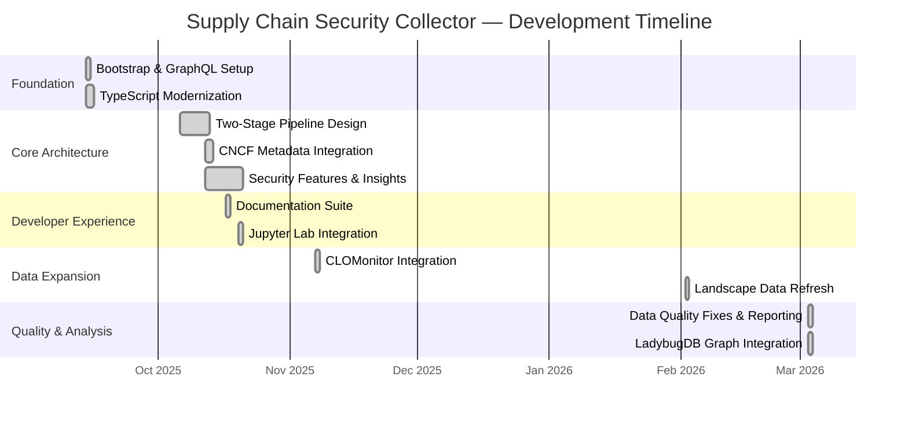
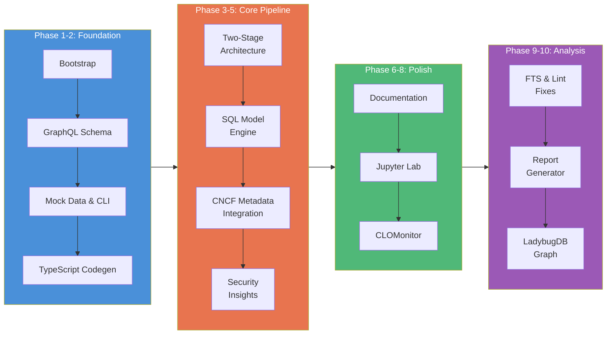
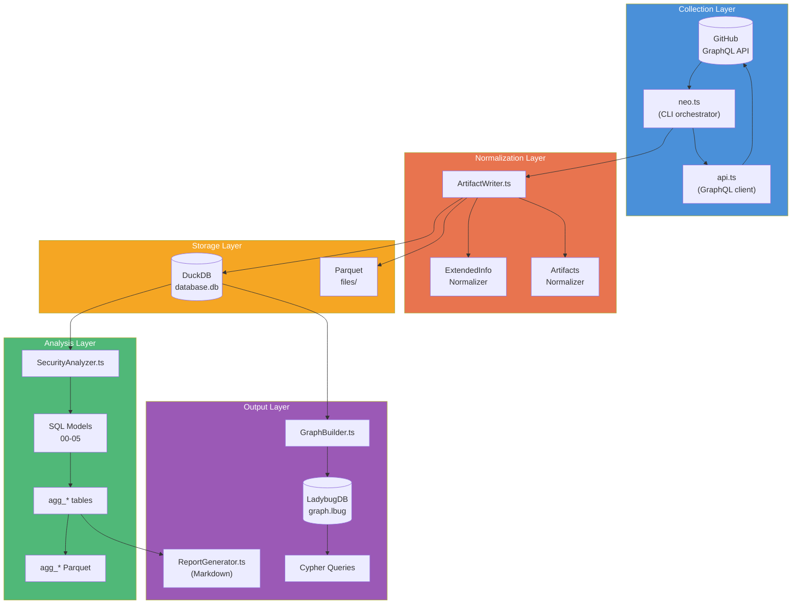

# Project Milestones

This directory tracks the evolution of the GitHub Supply Chain Security Data Collector across its development phases. Each milestone document captures the work completed, architecture decisions, verification results, and key metrics.

## Project Timeline

## Phase Map

## Architecture at a Glance

## Milestone Index

| # | Milestone | Date | Doc |
|---|-----------|------|-----|
| 1 | Bootstrap & GraphQL Foundation | 2025-09-14 | [001-bootstrap.md](./001-bootstrap.md) |
| 2 | Two-Stage Pipeline Architecture | 2025-10-06 | [002-pipeline-architecture.md](./002-pipeline-architecture.md) |
| 3 | CNCF Integration & Production Scale | 2025-10-12 | [003-cncf-integration.md](./003-cncf-integration.md) |
| 4 | Security Features & Insights | 2025-10-12 | [004-security-features.md](./004-security-features.md) |
| 5 | Documentation, Jupyter & CLOMonitor | 2025-10-17 | [005-devex-polish.md](./005-devex-polish.md) |
| 6 | Data Quality Fixes, Reporting & Graph DB | 2026-03-03 | [006-quality-reporting-graph.md](./006-quality-reporting-graph.md) |

## Key Metrics (as of 2026-03-03)

| Metric | Value |
|--------|-------|
| Total commits | 105 |
| CNCF projects supported | 239 |
| SQL analysis models | 7 |
| Base tables | 10 |
| Aggregation tables | 11 |
| Detection tool patterns | 20+ |
| Graph node types | 7 |
| Graph relationship types | 6 |
| TypeScript (core) | ~3,400 lines |
| SQL (models) | ~1,240 lines |
