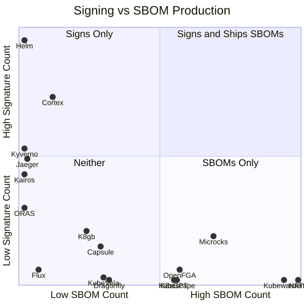
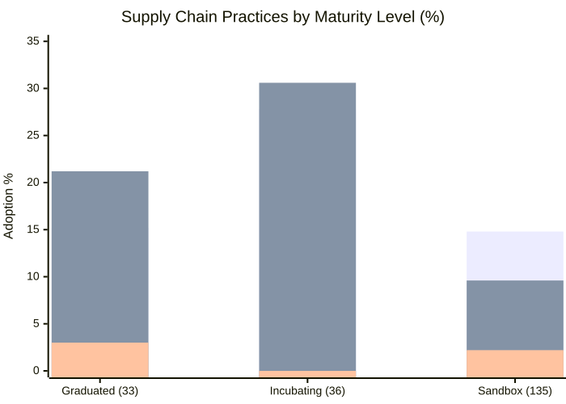
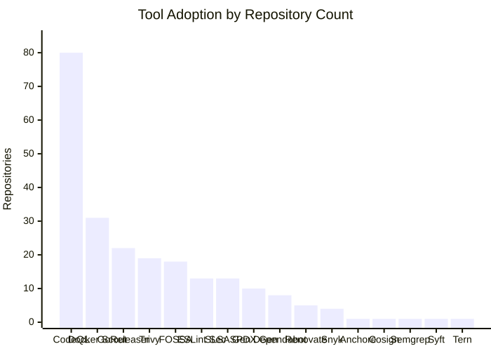
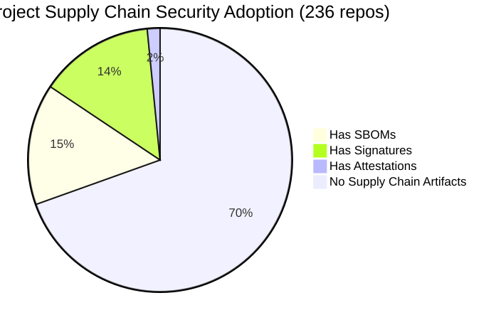

# CNCF supply chain security: what we can see from GitHub

**An observational study of 236 CNCF projects -- what's visible, what's not, and what's next**

**March 2026** | 236 projects | 4,169 releases | 39,304 assets | 2,784 workflows

---

## 0. scope and visibility

This report measures supply chain security practices that are **observable through GitHub**. It is not a census of what projects do. It is a census of what we can see from here.

### what we query

| data source | method |
|-------------|--------|
| releases and release assets | GitHub GraphQL API, 20 most recent releases per repo |
| CI/CD workflow files | `.github/workflows/*.yml` via GraphQL (default branch) |
| security metadata | `SECURITY-INSIGHTS.yml` presence in repo root |

### what this lets us see

- SBOMs, signatures, attestations, and provenance files **attached to GitHub releases**
- Security tools (cosign, trivy, syft, CodeQL, etc.) **referenced in GitHub Actions workflows**
- SBOM format (SPDX vs CycloneDX) via **filename pattern matching on release assets**

### what this does not see

| blind spot | why it matters |
|-----------|----------------|
| OCI registry artifacts | Projects using `cosign attach sbom`, `cosign sign`, or `crane` publish to container registries, not GitHub releases. We see none of this. |
| GitHub Attestations API | GitHub stores SLSA provenance via `gh attestation` separately from release assets. We do not query this API. |
| non-GitHub CI systems | Kubernetes uses Prow. Other projects use Jenkins, GitLab CI, Tekton. Our workflow scanning covers GitHub Actions only. |
| package manager SBOMs | npm, PyPI, and OCI registries can carry SBOMs. We only see GitHub release assets. |
| private signing processes | GPG signing, `krel`+cosign pipelines, air-gapped signing ceremonies -- none of these are visible in public GitHub data. |
| SBOM/signature quality | We detect presence, not correctness. An empty SBOM still counts. |

**The framing for everything that follows:** absence of evidence is not evidence of absence. When this report says "X was not observed," it means X did not appear in the data sources listed above. The project may well do X somewhere we cannot see.

---

## 1. questions we can now answer

**Q: What percentage of CNCF projects ship SBOMs as GitHub release assets?**
16.1% (38 of 236 repositories)

**Q: What percentage of CNCF projects have signatures in their GitHub release assets?**
15.3% (36 of 236 repositories)

**Q: How many projects have both SBOMs and signatures in GitHub release assets?**
14 projects. Less than 6% of the landscape.

**Q: Do graduated projects lead on supply chain security (as observed via GitHub)?**
No. Incubating projects outperform graduated on both SBOM presence in releases (27.8% vs 15.2%) and signing (30.6% vs 21.2%).

**Q: What is the most widely referenced security tool in GitHub Actions workflows?**
CodeQL, referenced in 80 repositories (33.9%). The next closest is Docker Scout at 31 (13.1%).

**Q: How many projects have attestation artifacts in their GitHub releases?**
4 projects: containerd (graduated), kubewarden-controller, compliance-trestle, and ko (all sandbox).

**Q: What is the dominant SBOM format in GitHub release assets?**
SPDX. Of 38 repos with SBOMs in releases, 19 use SPDX, 3 use CycloneDX, and 19 are unclassified format.

**Q: How many projects have a SECURITY-INSIGHTS.yml file?**
27 projects.

**Q: Does any CNCF project reference cosign in GitHub Actions workflows?**
One. A single repository out of 236 references cosign in its GitHub Actions workflow files.

**Q: How much SLSA provenance exists in GitHub release assets?**
525 SLSA provenance artifacts across 25 repositories. 13 repos reference the slsa-github-generator in GitHub Actions workflows.

> **Gap note:** These numbers reflect GitHub release assets and GitHub Actions workflows only. Projects publishing provenance via the GitHub Attestations API, OCI registries, or non-GitHub CI systems are not counted. The true number of CNCF projects with SLSA provenance is likely higher.

---

## 2. key findings

### finding 1: the pipeline gap is a cliff, not a slope (observed via GitHub)

236 CNCF projects narrow to a single project referencing cosign in GitHub Actions. Each step loses most of the cohort.

| stage | observed count | % of total |
|-------|------:|----------:|
| total projects | 236 | 100% |
| reference code scanners in GitHub Actions | 89 | 37.7% |
| reference container scanners in GitHub Actions | 49 | 20.8% |
| ship SBOMs in GitHub release assets | 38 | 16.1% |
| have signatures in GitHub release assets | 36 | 15.3% |
| reference signing tools in GitHub Actions | 14 | 5.9% |
| have attestation artifacts in GitHub releases | 4 | 1.7% |
| reference cosign in GitHub Actions | 1 | 0.4% |

This matters because the CNCF ecosystem is the reference implementation for cloud native. If CNCF projects do not ship signed, attested artifacts with SBOMs, downstream consumers have no way to verify provenance.

> **Gap note:** The bottom of this funnel is almost certainly undercounted. Kubernetes signs releases via `krel` + cosign through Prow -- none of which appears in GitHub Actions. Sigstore/cosign itself signs via Prow. Projects using `goreleaser` with signing enabled may sign without a dedicated workflow step visible to our text search. The cliff is real, but the floor is not zero.

### finding 2: signing and SBOMs are separate worlds (in GitHub release assets)

Projects that have signatures in releases tend not to ship SBOMs as release assets. Projects that ship SBOMs tend not to have signatures. Only 14 do both.

The starkest examples:
- **Helm** has 684 signature artifacts across 20 releases but ships zero SBOMs as release assets.
- **NATS Server** ships 280 SBOMs (SPDX) in releases but has zero signature artifacts.
- **Kubewarden** ships 262 SBOMs in releases but has zero signature artifacts.

This suggests these practices evolved independently. The toolchains are different (cosign/sigstore for signing, syft/trivy for SBOMs), the communities are different, and no single tool does both well in CI.

> **Gap note:** Helm may distribute SBOMs via OCI registry metadata or Helm chart provenance files. NATS may sign container images in a registry. This finding reflects GitHub release assets only -- the split may be less stark when all distribution channels are considered.

### finding 3: incubating projects outperform graduated on observable supply chain security

| metric (observed in GitHub releases) | graduated (33) | incubating (36) | sandbox (135) |
|--------|---------------:|----------------:|--------------:|
| SBOMs in release assets | 15.2% | 27.8% | 14.8% |
| signatures in release assets | 21.2% | 30.6% | 9.6% |
| both SBOM + signing in releases | 2 (6.1%) | 5 (13.9%) | 6 (4.4%) |
| attestation artifacts in releases | 1 (3.0%) | 0 (0.0%) | 3 (2.2%) |

Incubating projects are nearly twice as likely as graduated projects to ship SBOMs in release assets (27.8% vs 15.2%). This likely reflects a generational effect: projects that graduated years ago built their release pipelines before SBOMs and signing became standard practice, and have not retrofitted.

> **Gap note:** Graduated projects are more likely to have complex, non-GitHub release infrastructure (Prow, custom CI, release engineering teams). Their lower numbers here may partly reflect practices happening outside our visibility window.

### finding 4: only 6.1% of graduated projects have both SBOMs and signatures in GitHub releases

Of 33 graduated projects, exactly 2 have both SBOMs and signatures in their GitHub release assets: **Jaeger** and **Flux**. The remaining 31 graduated projects are missing at least one of these in their GitHub releases.

Notable graduated projects where neither SBOMs nor signatures were observed in GitHub release assets:
- Prometheus, Kubernetes (etcd), CoreDNS, Harbor, Linkerd, containerd, OPA, Vitess, KEDA, Dapr, Falco

> **Gap note:** Kubernetes uses `krel` for releases with cosign signing and SLSA provenance -- none of which lands in GitHub release assets. containerd has attestation artifacts but not SBOMs in releases. Prometheus publishes container images that may be signed in-registry. The absence here does not mean these projects lack supply chain security practices -- it means those practices are not visible through GitHub release assets.

### finding 5: SLSA provenance exists in releases but sigstore bundles are rare

| artifact type (observed in GitHub release assets) | count |
|--------------|------:|
| SLSA provenance | 525 |
| generic attestation | 365 |
| sigstore bundle | 167 |
| container attestation | 53 |
| license file | 45 |
| VEX document | 2 |
| in-toto link | 0 |
| in-toto layout | 0 |
| SWID tag | 0 |

525 SLSA provenance artifacts is significant, but they concentrate in the 13 repos referencing `slsa-github-generator` in GitHub Actions. Sigstore bundles (167) are even more concentrated. VEX documents barely exist in release assets (2 total). The in-toto project itself ships signed artifacts but does not attach in-toto link/layout files to GitHub releases.

> **Gap note:** The GitHub Attestations API (`gh attestation verify`) stores SLSA provenance separately from release assets. Projects using `actions/attest-build-provenance` generate provenance that we do not count here. The true SLSA coverage across CNCF is likely materially higher than what release assets show.

---

## 3. signing leaders (by signature artifacts in GitHub releases)

Top 10 projects by signature artifact count in their 20 most recent GitHub releases.

| project | observed signatures | observed SBOMs | maturity |
|---------|----------:|------:|----------|
| helm/helm | 684 | 0 | graduated |
| cortexproject/cortex | 501 | 34 | incubating |
| kyverno/kyverno | 360 | 0 | incubating |
| jaegertracing/jaeger | 335 | 5 | graduated |
| kairos-io/kairos | 294 | 0 | sandbox |
| oras-project/oras | 206 | 0 | sandbox |
| k8gb-io/k8gb | 146 | 68 | sandbox |
| microcks/microcks | 132 | 192 | sandbox |
| cloudnative-pg/cloudnative-pg | 130 | 16 | sandbox |
| k0sproject/k0s | 120 | 40 | sandbox |

Helm dominates with 684 signatures (every release asset is signed). Cortex is second at 501. Only 3 of the top 10 also ship SBOMs in release assets.

> **Gap note:** Projects signing container images in OCI registries (e.g., via `cosign sign`) are not represented here. This table reflects GitHub release assets only.

---

## 4. SBOM leaders (by SBOMs in GitHub releases)

Top 10 projects by SBOM artifact count in GitHub release assets.

| project | observed SBOMs | format | observed signatures | maturity |
|---------|------:|--------|----------:|----------|
| nats-io/nats-server | 280 | SPDX | 0 | incubating |
| kubewarden/kubewarden-controller | 262 | SPDX | 0 | sandbox |
| microcks/microcks | 192 | SPDX | 132 | sandbox |
| openfga/openfga | 160 | unclassified | 40 | incubating |
| kubescape/kubescape | 158 | unclassified | 0 | incubating |
| k8sgpt-ai/k8sgpt | 153 | SPDX | 0 | sandbox |
| getsops/sops | 90 | SPDX | 28 | sandbox |
| dragonflyoss/dragonfly | 90 | SPDX | 0 | graduated |
| armadaproject/armada | 85 | unclassified | 0 | sandbox |
| kubevela/kubevela | 84 | SPDX | 12 | incubating |

NATS leads with 280 SBOMs across 20 releases -- every release ships SPDX SBOMs for every binary. Yet no signature artifacts were observed in its releases. SPDX is the dominant format. CycloneDX appears in only 3 repositories across the entire landscape.

> **Gap note:** Projects may distribute SBOMs via package managers (npm provenance, PyPI), OCI registries, or dedicated SBOM repositories. NATS may sign via other mechanisms. "Zero signatures observed in GitHub releases" is not the same as "NATS doesn't sign."

---

## 5. full pipeline projects (both SBOMs and signatures observed in GitHub releases)

These 14 projects have both SBOMs and signatures in their GitHub release assets. This is the complete list of projects where both practices are observable via GitHub releases.

| project | assets | observed SBOMs | observed signatures | SPDX | CycloneDX | CodeQL | Trivy | GoReleaser | maturity |
|---------|-------:|------:|-----------:|:----:|:---------:|:------:|:-----:|:----------:|----------|
| cortexproject/cortex | 998 | 34 | 501 | -- | -- | -- | -- | -- | incubating |
| jaegertracing/jaeger | 990 | 5 | 335 | yes | -- | yes | -- | -- | graduated |
| kubevela/kubevela | 602 | 84 | 12 | yes | -- | yes | yes | -- | incubating |
| cloudnative-pg/cloudnative-pg | 587 | 16 | 130 | -- | -- | yes | -- | -- | sandbox |
| openfga/openfga | 400 | 160 | 40 | -- | -- | yes | -- | -- | incubating |
| k0sproject/k0s | 358 | 40 | 120 | yes | -- | -- | -- | -- | sandbox |
| fluxcd/flux2 | 340 | 20 | 40 | yes | -- | -- | -- | yes | graduated |
| getsops/sops | 334 | 90 | 28 | yes | -- | yes | -- | -- | sandbox |
| k8gb-io/k8gb | 290 | 68 | 146 | -- | -- | yes | -- | -- | sandbox |
| microcks/microcks | 264 | 192 | 132 | yes | -- | -- | -- | -- | sandbox |
| artifacthub/hub | 231 | 78 | 13 | -- | -- | yes | -- | -- | incubating |
| projectcapsule/capsule | 212 | 80 | 100 | -- | -- | -- | -- | yes | sandbox |
| chaos-mesh/chaos-mesh | 94 | 19 | 75 | yes | -- | -- | -- | -- | incubating |
| ContainerSSH/ContainerSSH | 268 | 3 | 64 | -- | -- | -- | -- | -- | -- |

Only 2 of these are graduated (Jaeger, Flux). The majority are sandbox projects that adopted both practices from the start.

---

## 6. tool adoption landscape (observed in GitHub Actions workflows)

All adoption numbers below reflect tools **referenced in GitHub Actions workflow files**. Projects using these tools in other CI systems (Prow, Jenkins, GitLab CI, Tekton) are not counted.

### code scanners (referenced in GitHub Actions)

| tool | repos | workflows | observed adoption % |
|------|------:|----------:|-----------:|
| codeql | 80 | 82 | 33.9% |
| eslint-security | 13 | 14 | 5.5% |
| semgrep | 1 | 1 | 0.4% |

### container scanners (referenced in GitHub Actions)

| tool | repos | workflows | observed adoption % |
|------|------:|----------:|-----------:|
| docker-scout | 31 | 62 | 13.1% |
| trivy | 19 | 23 | 8.1% |

### SBOM generators (referenced in GitHub Actions)

| tool | repos | workflows | observed adoption % |
|------|------:|----------:|-----------:|
| trivy | 19 | 23 | 8.1% |
| spdx-sbom-generator | 10 | 11 | 4.2% |
| syft | 1 | 1 | 0.4% |
| tern | 1 | 1 | 0.4% |

### signers (referenced in GitHub Actions)

| tool | repos | workflows | observed adoption % |
|------|------:|----------:|-----------:|
| slsa-github-generator | 13 | 15 | 5.5% |
| cosign | 1 | 1 | 0.4% |

> **Gap note:** cosign is the standard signing tool in the cloud native ecosystem. Seeing it referenced in only 1 GitHub Actions workflow is a strong signal that cosign usage happens elsewhere -- in Prow pipelines, `goreleaser` configs, Makefiles, or OCI registry workflows that our GitHub Actions text search does not cover.

### dependency scanners (referenced in GitHub Actions)

| tool | repos | workflows | observed adoption % |
|------|------:|----------:|-----------:|
| fossa | 18 | 19 | 7.6% |
| dependabot | 8 | 8 | 3.4% |
| renovate | 5 | 7 | 2.1% |

### vulnerability scanners (referenced in GitHub Actions)

| tool | repos | workflows | observed adoption % |
|------|------:|----------:|-----------:|
| snyk | 4 | 4 | 1.7% |
| anchore | 1 | 1 | 0.4% |

### release automation (referenced in GitHub Actions)

| tool | repos | workflows | observed adoption % |
|------|------:|----------:|-----------:|
| goreleaser | 22 | 24 | 9.3% |

CodeQL dominates code scanning at 33.9% observed adoption in GitHub Actions. Docker Scout leads container scanning. The signing category is nearly empty in GitHub Actions: slsa-github-generator in 13 repos, cosign in 1. GoReleaser (22 repos) is notable because it can generate SBOMs and signatures as part of the release process, but it is counted separately from those categories.

---

## 7. by maturity level (observed via GitHub)

### artifact presence in GitHub release assets

| metric | graduated (33) | incubating (36) | sandbox (135) | archived (23) |
|--------|---------------:|----------------:|--------------:|--------------:|
| SBOMs observed in releases | 5 (15.2%) | 10 (27.8%) | 20 (14.8%) | 1 (4.3%) |
| signatures observed in releases | 7 (21.2%) | 11 (30.6%) | 13 (9.6%) | 2 (8.7%) |
| attestations observed in releases | 1 (3.0%) | 0 (0.0%) | 3 (2.2%) | 0 (0.0%) |
| both SBOM + sig observed in releases | 2 (6.1%) | 5 (13.9%) | 6 (4.4%) | 0 (0.0%) |

### tool references in GitHub Actions workflows

| tool | graduated (33) | incubating (36) | sandbox (135) |
|------|---------------:|----------------:|--------------:|
| CodeQL | 17 (51.5%) | 15 (41.7%) | 40 (29.6%) |
| Trivy | 2 (6.1%) | 5 (13.9%) | 10 (7.4%) |
| GoReleaser | 3 (9.1%) | 6 (16.7%) | 11 (8.1%) |
| Cosign (in GitHub Actions) | 0 (0.0%) | 0 (0.0%) | 0 (0.0%) |
| SLSA generator | 1 (3.0%) | 3 (8.3%) | 7 (5.2%) |

CodeQL is the one area where graduated projects lead (51.5% vs 41.7% incubating). On every other observable metric, incubating projects are ahead. Zero graduated projects reference cosign in GitHub Actions workflows.

> **Gap note:** The cosign row reads 0/0/0 for GitHub Actions workflows. But cosign is used extensively across CNCF -- just not in ways visible to our workflow text search. Kubernetes, Sigstore, and other graduated projects sign with cosign via Prow, Tekton, and custom tooling.

---

## 8. advanced artifacts (observed in GitHub release assets)

25 repositories contain advanced supply chain artifacts beyond basic SBOMs and signatures in their GitHub release assets.

| artifact type | observed count | description |
|--------------|------:|-------------|
| SLSA provenance | 525 | Build provenance following SLSA framework |
| generic attestation | 365 | Unclassified attestation documents |
| sigstore bundle | 167 | Sigstore verification bundles |
| container attestation | 53 | OCI container-level attestations |
| license file | 45 | Machine-readable license artifacts |
| VEX document | 2 | Vulnerability Exploitability eXchange |
| in-toto link | 0 | Not observed in GitHub release assets |
| in-toto layout | 0 | Not observed in GitHub release assets |
| SWID tag | 0 | Not observed in GitHub release assets |

SLSA provenance is the most common advanced artifact at 525 instances in release assets. This correlates with the 13 repos referencing `slsa-github-generator` in their workflows. Sigstore bundles (167) provide cryptographic verification material. VEX documents -- which communicate whether known vulnerabilities are actually exploitable -- are nearly absent from release assets (2 total). The in-toto project, despite being a CNCF graduated project focused on supply chain integrity, does not attach its own link/layout artifacts to GitHub releases.

> **Gap note:** The GitHub Attestations API is a major blind spot. Projects using `actions/attest-build-provenance` or `gh attestation` store SLSA provenance in a GitHub-managed store that we do not query. The 525 number is a floor, not a ceiling.

---

## 9. closing the gap

This study sees what GitHub shows us. Here is what it would take to see more.

| data source | what it would reveal | difficulty |
|-------------|---------------------|------------|
| **GitHub Attestations API** | SLSA provenance stored via `gh attestation verify`, `actions/attest-build-provenance` | low -- public API, well-documented |
| **OCI registry scanning** | Container image signatures (`cosign verify`), attached SBOMs (`cosign tree`), attestations | medium -- requires iterating registries per project |
| **package manager provenance** | npm provenance attestations, PyPI Trusted Publisher provenance | medium -- per-ecosystem API |
| **non-GitHub CI analysis** | Prow, Tekton, GitLab CI, Jenkins pipeline configs for signing/SBOM/attestation steps | hard -- no unified API, project-specific config locations |
| **GUAC integration** | Dependency graph correlation, transitive SBOM/VEX coverage | hard -- requires running GUAC ingestion |
| **SECURITY-INSIGHTS.yml content** | Self-reported signing practices, security contacts, vulnerability disclosure | low -- we already detect presence, just need to parse content |

The highest-value addition is the GitHub Attestations API. It is a single API endpoint that would likely reveal significant SLSA provenance we are currently missing. OCI registry scanning is second -- it would surface cosign signatures and attached SBOMs for container-native projects.

Until these gaps are closed, treat every number in this report as a lower bound.

---

## 10. methodology

### data collection

- **Source**: GitHub GraphQL API (repos, releases, release assets, workflow files)
- **Scope**: 236 CNCF projects (graduated, incubating, sandbox, archived) using primary repositories from the CNCF landscape
- **Release depth**: 20 most recent releases per repository
- **Workflow coverage**: All `.github/workflows/*.yml` files in default branch

### analysis approach

- **Asset classification**: Pattern-based matching on filenames (e.g., `.sbom.json`, `.sig`, `.sigstore`, `.att`, `.intoto.jsonl`, `.spdx`, `.cdx`)
- **Workflow scanning**: Full-text search (BM25) against workflow content for tool references (cosign, trivy, syft, codeql, etc.)
- **SBOM format detection**: Filename patterns for SPDX (`.spdx.json`, `.spdx`) and CycloneDX (`.cdx.json`, `.bom.json`)
- **Maturity data**: CNCF landscape API joined to repository analysis

### what this measures

- Presence of supply chain artifacts in GitHub release assets
- References to security tools in GitHub Actions workflows
- SBOM and signature counts per repository
- Format distribution across the landscape

### what this does not measure

- Container image signatures (OCI registry, not GitHub releases)
- SBOMs distributed via package managers (npm, PyPI, etc.)
- Provenance stored in the GitHub Attestations API
- Signing done outside GitHub Actions (e.g., local GPG signing, Prow pipelines, `krel`)
- Quality or completeness of SBOMs
- Whether signatures are verified by consumers
- Private or internal security practices not visible in public repos
- Non-GitHub CI/CD pipeline configurations (Prow, Tekton, Jenkins, GitLab CI)

---

---

*Data collected February 2026. Analysis by supply-chain-security-collector. Every number in this report is a lower bound on actual practice.*
