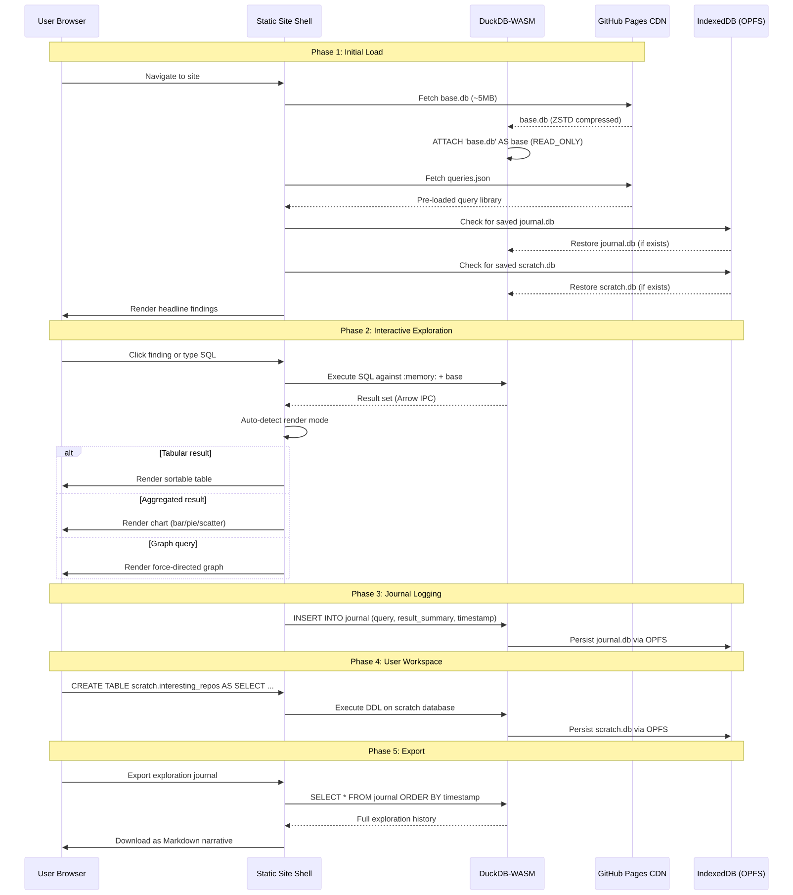

# Exploration Platform: Architecture Specification

**Status:** DRAFT | **Date:** 2026-03-30 | **Author:** Matt Young + Claude Opus 4.6

An interactive, zero-backend platform for exploring CNCF supply chain security data. Static site served from GitHub Pages. Everything runs client-side: DuckDB-WASM as the analytical engine, IndexedDB for persistence, and a query journal that captures every exploration path.

---

## 1. System Architecture



### Component Map

| Component | Role | Runtime |
|-----------|------|---------|
| Site Shell | SPA container, routing, layout | Browser (Preact) |
| Query Editor | SQL authoring with syntax highlighting | Browser (Monaco) |
| Query Library | Pre-loaded questions as one-click queries | Static JSON asset |
| Parameter Controls | Dropdowns that rewrite WHERE clauses | Browser (Preact) |
| DuckDB-WASM | Analytical SQL engine, all query execution | Browser (WASM) |
| Table Renderer | Sortable, filterable result tables | Browser (AG Grid Community) |
| Chart Renderer | Bar, pie, scatter, heatmap visualizations | Browser (Observable Plot) |
| Mermaid Renderer | Architecture and flow diagrams | Browser (mermaid.js) |
| Graph Renderer | Force-directed graph exploration | Browser (Cytoscape.js) |
| IndexedDB / OPFS | Persistent storage for user databases | Browser storage |
| base.db | Read-only dataset from collection pipeline | Static asset (CDN) |
| scratch.db | User-created tables and saved results | IndexedDB-backed |
| journal.db | Exploration history and annotations | IndexedDB-backed |

### Data Flow Summary



1. Page load: fetch `base.db` from CDN, ATTACH as read-only
2. Restore `journal.db` and `scratch.db` from IndexedDB (if present)
3. Render headline findings from pre-computed `report.json`
4. User runs query (click library item or type SQL)
5. DuckDB-WASM executes against `:memory:` with `base` attached
6. Results auto-route to the appropriate renderer
7. Query + result summary logged to `journal.db`
8. User can CREATE TABLE in `scratch.db` to save intermediate results
9. On reload, journal and scratch restore from IndexedDB

---

## 2. Database Architecture

### 2.1 base.db: The Static Dataset

**Source:** Output of the collection pipeline (`npm start` followed by `npm run analyze`).

**Build process:**

```sql
-- Export a stripped database from the full 57MB collection output
-- Excludes: raw_* tables, FTS indexes (terms/docs/dict/stats/stopwords/fields)
-- Includes: all base_* and agg_* tables

ATTACH 'output/cncf-full-landscape/current/database.db' AS source (READ_ONLY);
ATTACH 'site/base.db' AS target;

-- Copy base tables
CREATE TABLE target.base_repositories AS SELECT * FROM source.base_repositories;
CREATE TABLE target.base_releases AS SELECT * FROM source.base_releases;
CREATE TABLE target.base_release_assets AS SELECT * FROM source.base_release_assets;
CREATE TABLE target.base_workflows AS
  SELECT id, repository_id, filename, path FROM source.base_workflows;  -- strip content column
CREATE TABLE target.base_branch_protection_rules AS SELECT * FROM source.base_branch_protection_rules;
CREATE TABLE target.base_cncf_projects AS SELECT * FROM source.base_cncf_projects;
CREATE TABLE target.base_cncf_project_repos AS SELECT * FROM source.base_cncf_project_repos;
CREATE TABLE target.base_si_documents AS SELECT * FROM source.base_si_documents;
CREATE TABLE target.base_si_sboms AS SELECT * FROM source.base_si_sboms;
CREATE TABLE target.base_security_md AS SELECT * FROM source.base_security_md;

-- Copy aggregated tables
CREATE TABLE target.agg_artifact_patterns AS SELECT * FROM source.agg_artifact_patterns;
CREATE TABLE target.agg_workflow_tools AS SELECT * FROM source.agg_workflow_tools;
CREATE TABLE target.agg_repo_summary AS SELECT * FROM source.agg_repo_summary;
CREATE TABLE target.agg_repo_summary_sorted AS SELECT * FROM source.agg_repo_summary_sorted;
CREATE TABLE target.agg_repo_detail AS SELECT * FROM source.agg_repo_detail;
CREATE TABLE target.agg_cncf_project_summary AS SELECT * FROM source.agg_cncf_project_summary;
CREATE TABLE target.agg_executive_summary AS SELECT * FROM source.agg_executive_summary;
CREATE TABLE target.agg_tool_summary AS SELECT * FROM source.agg_tool_summary;
CREATE TABLE target.agg_tool_category_summary AS SELECT * FROM source.agg_tool_category_summary;
CREATE TABLE target.agg_sbom_summary AS SELECT * FROM source.agg_sbom_summary;
CREATE TABLE target.agg_advanced_artifacts AS SELECT * FROM source.agg_advanced_artifacts;
CREATE TABLE target.agg_si_attestations AS SELECT * FROM source.agg_si_attestations;

DETACH target;
```

**Size budget:**

| What | Current size | In base.db | Notes |
|------|-------------|------------|-------|
| Full database.db | 57 MB | -- | Includes FTS indexes, raw data |
| All Parquet files | 5.5 MB | -- | Compressed columnar |
| base_workflows (with content) | 1.6 MB | ~20 KB | Strip workflow YAML content |
| base_release_assets | 548 KB | 548 KB | Keep full |
| agg_artifact_patterns | 568 KB | 568 KB | Keep full |
| All other tables | ~300 KB | 300 KB | Small tables |
| **Estimated base.db total** | -- | **~2 MB** | Well under 10MB budget |

The critical optimization is stripping `base_workflows.content` (the raw YAML). Workflow content is 1.6MB of the Parquet and dominates the full database due to FTS indexes. The `agg_workflow_tools` table already has the derived tool detections -- that is what users query.

If workflow content is needed for ad-hoc text search, serve it as a separate `workflows-content.db` file that users can opt to load (~2MB additional).

### 2.2 scratch.db: User Workspace

Persisted to IndexedDB via DuckDB-WASM's OPFS (Origin Private File System) backend.

```sql
-- Users create their own tables here via the query editor
-- Example: save an interesting subset
CREATE TABLE scratch.my_graduated_repos AS
  SELECT * FROM base.agg_repo_summary WHERE maturity = 'graduated';

-- Example: save a cross-reference
CREATE TABLE scratch.signing_vs_sbom AS
  SELECT nameWithOwner, has_sbom_artifact, has_signature_artifact
  FROM base.agg_repo_summary
  WHERE has_sbom_artifact OR has_signature_artifact;
```

No predefined schema -- this is a freeform workspace. The platform provides:
- A "saved tables" panel showing all tables in scratch.db
- One-click DROP TABLE
- Export any table as CSV or Parquet

### 2.3 journal.db: Exploration History

```sql
CREATE TABLE journal_entries (
    id          TEXT PRIMARY KEY,       -- UUID v4
    parent_id   TEXT,                   -- FK to parent entry (for follow-up queries)
    created_at  TIMESTAMP NOT NULL DEFAULT current_timestamp,

    -- Query
    query_text  TEXT NOT NULL,          -- The SQL that was executed
    query_source TEXT NOT NULL,         -- 'editor' | 'library' | 'parameterized' | 'click-through'

    -- Result summary (not full results -- those can be re-run)
    row_count   INTEGER,
    column_count INTEGER,
    columns     TEXT,                   -- JSON array of column names
    execution_ms DOUBLE,
    error_message TEXT,                 -- NULL on success

    -- User annotation
    title       TEXT,                   -- User-assigned name
    notes       TEXT,                   -- Free-text annotation
    tags        TEXT,                   -- JSON array of tags: ["signing", "graduated", "interesting"]
    is_starred  BOOLEAN DEFAULT false,

    -- Render hint
    render_mode TEXT,                   -- 'table' | 'bar' | 'pie' | 'scatter' | 'graph' | 'mermaid'

    FOREIGN KEY (parent_id) REFERENCES journal_entries(id)
);

-- Index for tree traversal
CREATE INDEX idx_journal_parent ON journal_entries(parent_id);

-- Index for tag search
CREATE INDEX idx_journal_tags ON journal_entries(tags);

-- Index for chronological listing
CREATE INDEX idx_journal_created ON journal_entries(created_at DESC);
```

**Journal is queryable.** Users can run SQL against their own exploration history:

```sql
-- "Show me all queries I ran about signing"
SELECT title, query_text, created_at
FROM journal.journal_entries
WHERE query_text ILIKE '%sign%' OR tags LIKE '%signing%'
ORDER BY created_at DESC;

-- "What was my exploration tree for the SBOM investigation?"
WITH RECURSIVE tree AS (
    SELECT id, title, query_text, 0 as depth
    FROM journal.journal_entries
    WHERE title = 'SBOM deep dive' AND parent_id IS NULL
    UNION ALL
    SELECT j.id, j.title, j.query_text, t.depth + 1
    FROM journal.journal_entries j
    JOIN tree t ON j.parent_id = t.id
)
SELECT * FROM tree ORDER BY depth;
```

### 2.4 ATTACH/DETACH in DuckDB-WASM

DuckDB-WASM supports ATTACH with some constraints:

```javascript
// Initialize DuckDB-WASM
const DUCKDB_CONFIG = {
    path: 'duckdb-wasm.wasm',
    mainWorker: 'duckdb-browser-eh.worker.js',
};

const db = new duckdb.AsyncDuckDB();
await db.instantiate(bundle);
const conn = await db.connect();

// Register base.db file fetched from CDN
await db.registerFileBuffer('base.db', new Uint8Array(baseDbBuffer));
await conn.query("ATTACH 'base.db' AS base (READ_ONLY)");

// For persistence, use OPFS backend
// scratch.db and journal.db live in the browser's OPFS
await conn.query("ATTACH 'opfs://scratch.db' AS scratch");
await conn.query("ATTACH 'opfs://journal.db' AS journal");
```

**Key constraints:**
- DuckDB-WASM ATTACH works with registered file buffers or OPFS paths
- READ_ONLY prevents accidental writes to the base dataset
- OPFS provides true file-system-like persistence (survives browser restarts)
- Multiple databases can be attached simultaneously and cross-queried
- If OPFS is unavailable (older browsers), fall back to in-memory only with a warning

---

## 3. Query Editor UX

### 3.1 SQL Editor Component

**Choice: Monaco Editor** (the VS Code editor core).

Justification:
- Built-in SQL language support with syntax highlighting
- Autocomplete infrastructure (can register table/column completions from DuckDB catalog)
- Multi-cursor, find/replace, minimap -- users expect these from VS Code
- ~2MB gzipped, acceptable for a data exploration tool
- MIT licensed

Alternative considered: CodeMirror 6. Lighter (~500KB), but Monaco's autocomplete is significantly better for SQL, and the users of this tool (data engineers, security engineers) already know VS Code keybindings.

**Custom completions from live schema:**

```javascript
// Query DuckDB catalog and register Monaco completions
const tables = await conn.query(`
    SELECT table_name, column_name, data_type
    FROM information_schema.columns
    WHERE table_schema = 'main'
    ORDER BY table_name, ordinal_position
`);
// Register as Monaco completion items
```

### 3.2 Pre-loaded Query Library

Ship `queries.json` as a static asset containing every question from the findings report, plus common exploration queries.

```json
{
  "categories": [
    {
      "name": "Headline Findings",
      "queries": [
        {
          "id": "pipeline-gap",
          "title": "The pipeline gap: 236 projects to 1 with cosign",
          "description": "Each stage of supply chain security loses most projects",
          "sql": "SELECT 'total projects' as stage, COUNT(*) as count, 100.0 as pct FROM base.agg_repo_summary\nUNION ALL\nSELECT 'scan code', SUM(CASE WHEN uses_code_scanner THEN 1 ELSE 0 END), ROUND(100.0 * SUM(CASE WHEN uses_code_scanner THEN 1 ELSE 0 END) / COUNT(*), 1) FROM base.agg_repo_summary\nUNION ALL\n...",
          "render_hint": "bar",
          "tags": ["pipeline", "adoption", "headline"]
        },
        {
          "id": "signing-vs-sbom",
          "title": "Signing and SBOMs are separate worlds",
          "description": "Only 14 projects do both -- most do one or neither",
          "sql": "SELECT nameWithOwner, has_sbom_artifact, has_signature_artifact FROM base.agg_repo_summary WHERE has_sbom_artifact OR has_signature_artifact ORDER BY has_sbom_artifact DESC, has_signature_artifact DESC",
          "render_hint": "scatter",
          "tags": ["signing", "sbom", "headline"]
        }
      ]
    },
    {
      "name": "Maturity Analysis",
      "queries": [
        {
          "id": "maturity-comparison",
          "title": "Security adoption by maturity level",
          "sql": "SELECT maturity, COUNT(*) as projects, ROUND(100.0 * SUM(CASE WHEN has_sbom_artifact THEN 1 ELSE 0 END) / COUNT(*), 1) as sbom_pct, ROUND(100.0 * SUM(CASE WHEN has_signature_artifact THEN 1 ELSE 0 END) / COUNT(*), 1) as signing_pct FROM base.agg_cncf_project_summary GROUP BY maturity",
          "render_hint": "bar",
          "tags": ["maturity", "comparison"]
        }
      ]
    },
    {
      "name": "Tool Adoption",
      "queries": []
    },
    {
      "name": "Deep Dives",
      "queries": []
    },
    {
      "name": "Graph Queries (Cypher)",
      "queries": []
    }
  ]
}
```

### 3.3 Query Parameterization

Dropdowns and filters that rewrite the SQL before execution:

| Parameter | UI Control | SQL Rewrite |
|-----------|-----------|-------------|
| Maturity level | Dropdown: All / Graduated / Incubating / Sandbox | Appends `WHERE maturity = ?` or removes filter |
| CNCF category | Dropdown populated from `DISTINCT category` | Appends `WHERE category = ?` |
| Has SBOM | Toggle | Appends `WHERE has_sbom_artifact = true` |
| Has Signing | Toggle | Appends `WHERE has_signature_artifact = true` |
| Project name | Autocomplete text input | Appends `WHERE project_name ILIKE ?` |
| Min releases | Number input | Appends `WHERE total_releases >= ?` |

Implementation: parameterized queries use `$1`, `$2` placeholders. The UI builds the parameter array. DuckDB-WASM's prepared statement support handles injection safety.

### 3.4 Result Rendering: Auto-Detection

The renderer inspects the result shape and picks the best visualization:

```
Result shape analysis:
  - 1 row, multiple columns    -> KPI cards (executive summary style)
  - 2 columns (text, number)   -> horizontal bar chart
  - 2 columns (text, text)     -> table
  - 3+ columns, all numeric    -> heatmap or scatter
  - column named 'mermaid'     -> pass value to mermaid.js
  - any shape                  -> table (always available as fallback)
```

Users can override the auto-detected mode with a dropdown: Table | Bar | Pie | Scatter | Line | Heatmap.

---

## 4. Visualization Layer

### 4.1 Table Renderer

**Choice: AG Grid Community Edition** (free, MIT-like license for community).

Features used:
- Column sorting (click header)
- Column filtering (text/number/boolean filters)
- Column resizing and reordering
- CSV export from rendered table
- Virtual scrolling for large result sets (39K+ release assets)
- Cell renderers for booleans (checkmark/x), URLs (clickable links)

Alternative considered: TanStack Table. More lightweight but requires building all UI from scratch. AG Grid ships production-ready out of the box.

If bundle size is a hard constraint, fall back to a custom `<table>` with manual sort/filter -- the data volumes (236 repos, 4K releases) do not require virtualization for most queries.

### 4.2 Chart Renderer

**Choice: Observable Plot** (from the D3 team, ~130KB gzipped).

Justification:
- Declarative API: `Plot.barY(data, {x: "project", y: "count"}).plot()`
- Built on D3 but dramatically simpler for common chart types
- Produces SVG -- can be copied/saved as image
- No build step required, works as ES module
- Handles the exact chart types needed: bar, grouped bar, scatter, pie (via arc mark)
- Mark-based grammar naturally handles multi-series data

Chart types for this dataset:

| Chart | Use case | Example |
|-------|----------|---------|
| Bar (horizontal) | Tool adoption ranking | "Top 15 tools by repo count" |
| Grouped bar | Maturity comparison | "SBOM vs signing by maturity level" |
| Scatter | Two-variable correlation | "Signing adoption vs SBOM adoption per project" |
| Stacked bar | Pipeline stages | "The pipeline gap" |
| Pie/donut | Category distribution | "SBOM format distribution (SPDX vs CycloneDX)" |

### 4.3 Mermaid Renderer

**mermaid.js** (~500KB gzipped) for rendering architecture and flow diagrams.

Use cases:
- Pre-loaded diagrams: data pipeline overview, collection architecture
- Dynamic diagrams: generate Mermaid from query results (e.g., tool co-occurrence as a graph)

```javascript
// Example: generate a pie chart from query results
const result = await conn.query(`
    SELECT maturity, COUNT(*) as count
    FROM base.agg_cncf_project_summary
    GROUP BY maturity
`);

const mermaidCode = `pie title CNCF Projects by Maturity
${result.rows.map(r => `    "${r[0]}" : ${r[1]}`).join('\n')}`;

mermaid.render('chart', mermaidCode);
```

### 4.4 Graph Renderer

**Choice: Cytoscape.js** (~400KB gzipped).

Justification:
- Mature, well-documented force-directed layout engine
- Built-in support for labeled property graph display (nodes with types, edges with labels)
- Handles the graph sizes in this dataset (236 repos, ~300 tools, ~4K releases)
- Interactive: zoom, pan, click-to-inspect, neighborhood highlighting
- Multiple layout algorithms: force-directed (cose), hierarchical (dagre), circular
- Can export to PNG/SVG

The graph schema already exists in `src/graph/schema.ts`:
- Nodes: Repository, Release, ReleaseAsset, Workflow, CNCFProject, Tool, ToolCategory
- Edges: HAS_RELEASE, HAS_ASSET, HAS_WORKFLOW, BELONGS_TO, USES_TOOL, IN_CATEGORY

For Phase 4 (graph exploration), the options are:

**Option A: LadybugDB-WASM (preferred if feasible).** LadybugDB compiles to WASM. Load the property graph from `base.db` tables into LadybugDB-WASM, execute Cypher queries in-browser, render with Cytoscape. This would give users the full Cypher query language for graph exploration.

**Option B: DuckDB-as-graph (pragmatic fallback).** Implement graph traversal as recursive CTEs in DuckDB. Less elegant but avoids a second WASM engine. The existing Cypher queries from `src/graph/queries.ts` would be rewritten as SQL.

**Option C: Pre-computed graph JSON.** Export the LadybugDB graph as a static JSON file at build time. Cytoscape loads and renders it. Graph exploration is visual-only (no query language). Simplest to implement.

Recommendation: Start with Option C for Phase 4, evaluate LadybugDB-WASM feasibility for Phase 5.

---

## 5. Exploration Journal

### 5.1 Automatic Capture

Every query execution is logged automatically:

```javascript
async function executeAndLog(sql, source = 'editor', parentId = null) {
    const startMs = performance.now();
    let result, error;

    try {
        result = await conn.query(sql);
    } catch (e) {
        error = e.message;
    }

    const entry = {
        id: crypto.randomUUID(),
        parent_id: parentId,
        created_at: new Date().toISOString(),
        query_text: sql,
        query_source: source,
        row_count: result?.numRows ?? null,
        column_count: result?.numCols ?? null,
        columns: JSON.stringify(result?.schema?.fields?.map(f => f.name) ?? []),
        execution_ms: performance.now() - startMs,
        error_message: error ?? null,
        title: null,
        notes: null,
        tags: '[]',
        is_starred: false,
        render_mode: autoDetectRenderMode(result),
    };

    await conn.query(`INSERT INTO journal.journal_entries VALUES (?, ?, ?, ?, ?, ?, ?, ?, ?, ?, ?, ?, ?, ?, ?)`,
        Object.values(entry));

    return { result, journalId: entry.id };
}
```

### 5.2 Manual Annotation

After running a query, the user can:
- **Title it:** Click "Add title" to name the exploration step
- **Add notes:** Free-text annotation of what they found
- **Tag it:** Add tags from a suggested list or create custom tags
- **Star it:** Mark as interesting for later review

### 5.3 Tree Structure

Follow-up queries are linked to their parent via `parent_id`:

```
[Pipeline gap overview] (starred)
  ├── [Filter to graduated only]
  │     └── [Which graduated projects have NO security tools?]
  ├── [Filter to incubating only]
  │     └── [Top incubating projects by tool count]
  └── [Zoom into signing specifically]
        └── [Helm signing artifact count detail]
```

The UI shows this as a collapsible tree in the journal panel. Clicking any past entry re-runs the query and shows the result.

### 5.4 Export as Markdown Narrative

```markdown
# Exploration Journal: CNCF Supply Chain Security
Exported: 2026-03-30T14:22:00Z | 23 queries | 4 starred findings

## Pipeline Gap Investigation

### 1. Pipeline gap overview *
**Query:** `SELECT stage, count, pct FROM pipeline_stages ORDER BY sort_order`
**Result:** 7 rows, 3 columns (12ms)
**Finding:** Each stage loses 50-80% of the cohort. 236 projects narrow to 1.

#### 1.1 Filter to graduated only
**Query:** `SELECT ... WHERE maturity = 'graduated'`
**Result:** 33 rows (8ms)
**Notes:** Graduated projects are slightly better but still <25% adoption.

#### 1.2 Filter to incubating only
**Query:** `SELECT ... WHERE maturity = 'incubating'`
**Result:** 36 rows (7ms)
**Notes:** Incubating actually outperforms graduated. Surprising.

...
```

### 5.5 Import/Share Journals

Journals are portable:
- **Export:** Download `journal.db` as a file, or export as JSON
- **Import:** Upload a `journal.db` file to merge into the local journal
- **Share URL:** Encode a single query + parameters as a URL hash fragment (no server needed):
  `https://site.github.io/explore#q=SELECT...&render=bar`

For sharing full explorations, users export the markdown narrative and share it as a document, gist, or issue comment.

---

## 6. GitHub Pages Deployment

### 6.1 Build Process

```
Collection Pipeline (scheduled)          Static Site Build (on collection complete)
─────────────────────────────────         ──────────────────────────────────────────
npm start (full CNCF landscape)           1. Export base.db (strip raw/FTS)
    ↓                                     2. Generate report.json (headline findings)
npm run analyze (SQL models)              3. Generate queries.json (query library)
    ↓                                     4. Build static site (Vite + Preact)
output/cncf-full-landscape/current/       5. Copy base.db to site/public/
    database.db (57MB)                    6. Deploy to GitHub Pages
    parquet/*.parquet
    report.md
```

### 6.2 GitHub Action Workflow

```yaml
name: Update Exploration Platform

on:
  # Manual trigger
  workflow_dispatch:
  # Scheduled weekly collection
  schedule:
    - cron: '0 6 * * 1'  # Monday 6am UTC

permissions:
  contents: read
  pages: write
  id-token: write

concurrency:
  group: "pages"
  cancel-in-progress: false

jobs:
  collect:
    runs-on: ubuntu-latest
    steps:
      - uses: actions/checkout@v4
      - uses: actions/setup-node@v4
        with:
          node-version: '20'
      - run: npm ci
      - run: npm start
        env:
          GITHUB_PERSONAL_ACCESS_TOKEN: ${{ secrets.GH_PAT }}
      - run: npm run analyze
      - uses: actions/upload-artifact@v4
        with:
          name: collection-output
          path: output/cncf-full-landscape/current/

  build-site:
    needs: collect
    runs-on: ubuntu-latest
    steps:
      - uses: actions/checkout@v4
      - uses: actions/setup-node@v4
        with:
          node-version: '20'
      - uses: actions/download-artifact@v4
        with:
          name: collection-output
          path: output/

      # Export stripped base.db
      - name: Build base.db
        run: |
          npx duckdb -c "
            ATTACH 'output/database.db' AS source (READ_ONLY);
            ATTACH 'site/public/base.db' AS target;
            $(cat scripts/export-base-db.sql)
            DETACH target;
          "

      # Generate static assets
      - name: Generate report.json and queries.json
        run: node scripts/generate-site-data.js output/database.db

      # Build the static site
      - name: Build site
        working-directory: site
        run: |
          npm ci
          npm run build

      # Verify size budget
      - name: Check base.db size
        run: |
          SIZE=$(stat -f%z site/dist/base.db 2>/dev/null || stat -c%s site/dist/base.db)
          echo "base.db size: $((SIZE / 1024 / 1024))MB"
          if [ "$SIZE" -gt 10485760 ]; then
            echo "::error::base.db exceeds 10MB budget ($((SIZE / 1024 / 1024))MB)"
            exit 1
          fi

      - uses: actions/upload-pages-artifact@v3
        with:
          path: site/dist

  deploy:
    needs: build-site
    runs-on: ubuntu-latest
    environment:
      name: github-pages
      url: ${{ steps.deployment.outputs.page_url }}
    steps:
      - id: deployment
        uses: actions/deploy-pages@v4
```

### 6.3 Size Optimization

**What goes into base.db:**

| Include | Exclude | Reason |
|---------|---------|--------|
| All `base_*` tables (except workflow content) | `raw_*` tables | Raw API responses are 22MB |
| All `agg_*` tables | FTS index tables (`terms`, `docs`, `dict`, `stopwords`, `stats`, `fields`) | FTS indexes are 50MB+ and can be rebuilt |
| | `base_workflows.content` column | 1.6MB of YAML; serve separately if needed |

**Compression strategy:**
- DuckDB database files use internal compression
- GitHub Pages serves with gzip/brotli -- the .db file compresses well over HTTP
- Alternative: serve individual Parquet files (5.5MB total) and load them into DuckDB-WASM via `read_parquet()` instead of ATTACH. This trades slightly more complex loading for better HTTP caching (each table cached independently).

**Parquet-first loading variant (recommended if base.db > 5MB):**

```javascript
// Instead of one big base.db, load individual parquet files
const tables = [
    'base_repositories', 'base_releases', 'base_release_assets',
    'base_cncf_projects', 'base_cncf_project_repos',
    'agg_repo_summary', 'agg_artifact_patterns', 'agg_workflow_tools',
    'agg_cncf_project_summary', 'agg_executive_summary',
    'agg_tool_summary', 'agg_tool_category_summary',
    // ... remaining tables
];

// Lazy-load: fetch parquet files on demand
async function ensureTable(tableName) {
    const exists = await conn.query(
        `SELECT 1 FROM information_schema.tables WHERE table_name = '${tableName}'`
    );
    if (exists.numRows === 0) {
        const response = await fetch(`/parquet/${tableName}.parquet`);
        const buffer = await response.arrayBuffer();
        await db.registerFileBuffer(`${tableName}.parquet`, new Uint8Array(buffer));
        await conn.query(
            `CREATE TABLE ${tableName} AS SELECT * FROM read_parquet('${tableName}.parquet')`
        );
    }
}
```

This variant loads only the tables a query touches. For the "click a headline finding" flow, this means loading ~3 tables (~100KB) instead of the full base.db.

---

## 7. Technology Stack

### Recommended Stack

| Layer | Library | Version | Size (gzip) | Justification |
|-------|---------|---------|-------------|---------------|
| **Runtime** | DuckDB-WASM | 1.1+ | ~10MB | Mandatory. The analytical engine. |
| **UI Framework** | Preact | 10.x | ~4KB | React API compatibility at 1/10th the size. No need for Next/Remix -- this is a static SPA. |
| **SQL Editor** | Monaco Editor | 0.50+ | ~2MB | VS Code editor core. Best SQL autocomplete. Load on demand (not on initial page load). |
| **Charts** | Observable Plot | 0.6+ | ~130KB | D3-team quality, declarative API, SVG output. |
| **Tables** | AG Grid Community | 32+ | ~300KB | Production-ready data grid. Virtual scrolling for 39K-row results. |
| **Diagrams** | mermaid.js | 11+ | ~500KB | Standard for text-to-diagram. Load on demand. |
| **Graph Viz** | Cytoscape.js | 3.30+ | ~400KB | Force-directed graph layout. Load on demand. |
| **Build Tool** | Vite | 6+ | dev only | Fast builds, native ES modules, code splitting for lazy-load. |
| **Styling** | Tailwind CSS | 4+ | ~10KB | Utility-first, tree-shakeable, dark mode built-in. |
| **Icons** | Lucide | latest | ~2KB/icon | Tree-shakeable icon set. Only bundle what is used. |

**Total initial page load budget:** ~15MB (DuckDB-WASM dominates). Monaco, mermaid, and Cytoscape load on demand (user clicks "Edit SQL", "View Diagram", or "Graph View").

**Why Preact over React/Svelte/Vue:**
- React API compatibility -- can use React ecosystem libraries
- 4KB vs React's 40KB. For a static site, this matters
- Signals for reactive state (query results, journal entries)
- No SSR needed -- this is pure client-side

**Why not a heavier framework (Next.js, Remix, Astro):**
- No server. No SSR. No API routes. This is a static SPA loaded from a CDN.
- Vite + Preact gives us code splitting, hot reload, and fast builds with zero framework overhead.

### Dependency Graph

```
site/
├── package.json
├── vite.config.ts
├── index.html
├── public/
│   ├── base.db          (or parquet/ directory)
│   ├── queries.json
│   └── report.json
└── src/
    ├── main.tsx                          # Entry point
    ├── app.tsx                           # Root component, router
    ├── engine/
    │   ├── duckdb.ts                     # DuckDB-WASM init, query execution
    │   ├── journal.ts                    # Journal logging, tree management
    │   └── persistence.ts               # OPFS/IndexedDB management
    ├── components/
    │   ├── QueryEditor.tsx               # Monaco wrapper (lazy-loaded)
    │   ├── QueryLibrary.tsx              # Sidebar with categorized queries
    │   ├── ParameterBar.tsx              # Filter dropdowns
    │   ├── ResultPanel.tsx               # Auto-detecting result renderer
    │   ├── TableView.tsx                 # AG Grid wrapper
    │   ├── ChartView.tsx                 # Observable Plot wrapper
    │   ├── MermaidView.tsx               # mermaid.js wrapper (lazy-loaded)
    │   ├── GraphView.tsx                 # Cytoscape wrapper (lazy-loaded)
    │   ├── JournalPanel.tsx              # Exploration history tree
    │   ├── HeadlineFindings.tsx          # Landing page findings cards
    │   └── WorkspacePanel.tsx            # scratch.db table manager
    └── lib/
        ├── render-detect.ts              # Result shape -> render mode
        ├── query-rewrite.ts              # Parameter -> WHERE clause injection
        └── export.ts                     # Markdown/CSV/Parquet export
```

---

## 8. Phased Delivery

### Phase 1: Static Report with Embedded Queries

**Goal:** Replace the existing `report.md` with an interactive page. Users see findings and can click to see the underlying SQL and raw data.

**Deliverables:**
- Vite + Preact project scaffolded in `site/`
- DuckDB-WASM initialized, base.db loaded
- Headline findings rendered as cards (from `report.json`)
- Click any finding card -> shows the SQL query and result table
- Basic table rendering (no AG Grid yet -- use `<table>`)
- GitHub Pages deployment workflow
- No editor, no journal, no persistence

**Estimated effort:** 2-3 days dev work.
**Key risk:** DuckDB-WASM bundle size (~10MB). Mitigate with loading indicator and CDN caching.

### Phase 2: Live Query Editor + Result Rendering

**Goal:** Users can write and execute arbitrary SQL against the dataset.

**Deliverables:**
- Monaco Editor integration (lazy-loaded)
- Schema-aware autocomplete (tables and columns from DuckDB catalog)
- Parameter bar (maturity, category, tool dropdowns)
- Auto-detect result renderer (table vs chart)
- Observable Plot integration for chart rendering
- AG Grid for sortable/filterable tables
- Query library sidebar with categorized pre-loaded queries
- URL hash encoding for shareable queries

**Estimated effort:** 3-5 days dev work.
**Key risk:** Monaco Editor size. Mitigate with lazy loading -- only fetch when user clicks "Edit SQL".

### Phase 3: Exploration Journal with Persistence

**Goal:** Every query is logged. Users can annotate, tag, and export their exploration.

**Deliverables:**
- journal.db schema created on first use
- Automatic query logging (every execution)
- Journal panel with chronological and tree views
- Title, notes, tags, and star annotations
- OPFS persistence (survives page reload)
- scratch.db for user-created tables
- Workspace panel showing saved tables
- Export as markdown narrative
- Import/share journal files

**Estimated effort:** 3-4 days dev work.
**Key risk:** OPFS browser compatibility. Safari support landed in 16.4+. Fall back to in-memory with localStorage metadata for older browsers.

### Phase 4: Graph Exploration

**Goal:** Visual graph exploration of the CNCF project-tool-repository network.

**Deliverables:**
- Pre-computed graph JSON exported at build time (from LadybugDB schema)
- Cytoscape.js integration (lazy-loaded)
- Force-directed layout of project-tool relationships
- Click node to inspect properties
- Neighborhood highlighting (click repo -> see all tools, releases, project)
- Layout switching (force-directed, hierarchical, circular)
- Graph filtering (by maturity level, tool category)

**Estimated effort:** 3-4 days dev work.
**Key risk:** Graph size. 236 repos + 300 tools + 4K releases = ~5K nodes. Cytoscape handles this, but the layout may be slow. Mitigate by showing only the subgraph relevant to the current filter, not the full graph.

**Phase 5 (future): LadybugDB-WASM**
If LadybugDB ships a WASM build, integrate it for in-browser Cypher queries. The schema and queries from `src/graph/schema.ts` and `src/graph/queries.ts` would work directly.

---

## Appendix A: Questions the Platform Can Answer

These queries ship pre-loaded in the query library. Every finding from `cncf-supply-chain-findings.md` becomes a clickable, re-runnable, modifiable query.

| # | Question | Source Table(s) |
|---|----------|----------------|
| 1 | What % of CNCF projects ship SBOMs? | agg_executive_summary |
| 2 | What % sign their release artifacts? | agg_executive_summary |
| 3 | How many do both? | agg_repo_summary |
| 4 | Do graduated projects lead? | agg_cncf_project_summary |
| 5 | Most widely adopted security tool? | agg_tool_summary |
| 6 | How many projects have attestations? | agg_repo_summary |
| 7 | Dominant SBOM format? | agg_sbom_summary |
| 8 | SECURITY-INSIGHTS.yml adoption? | base_si_documents |
| 9 | Cosign in CI workflows? | agg_workflow_tools |
| 10 | SLSA provenance across landscape? | agg_advanced_artifacts |
| 11 | Tool co-occurrence patterns? | agg_workflow_tools (self-join) |
| 12 | Projects with zero security tooling? | agg_repo_summary |
| 13 | Release frequency vs security adoption? | base_releases + agg_repo_summary |
| 14 | Category-level security adoption? | agg_cncf_project_summary |
| 15 | Branch protection rule adoption? | base_branch_protection_rules |

## Appendix B: Browser Compatibility

| Feature | Chrome 119+ | Firefox 111+ | Safari 16.4+ | Edge 119+ |
|---------|:-----------:|:------------:|:------------:|:---------:|
| DuckDB-WASM | Yes | Yes | Yes | Yes |
| OPFS | Yes | Yes | Yes | Yes |
| SharedArrayBuffer (for DuckDB threads) | Yes | Yes | Yes* | Yes |
| Monaco Editor | Yes | Yes | Yes | Yes |

*Safari requires cross-origin isolation headers (`Cross-Origin-Opener-Policy: same-origin`, `Cross-Origin-Embedder-Policy: require-corp`). GitHub Pages does not set these by default. Workaround: use the single-threaded DuckDB-WASM bundle for Safari, or use a service worker to inject the headers.

## Appendix C: Size Budget Summary

| Asset | Size (gzip) | Load timing |
|-------|-------------|-------------|
| DuckDB-WASM (eh bundle) | ~10 MB | On page load |
| base.db (or parquet set) | ~2-3 MB | On page load |
| Preact + app code | ~50 KB | On page load |
| Tailwind CSS | ~10 KB | On page load |
| report.json | ~5 KB | On page load |
| queries.json | ~10 KB | On page load |
| **Initial load total** | **~13 MB** | |
| Monaco Editor | ~2 MB | On "Edit SQL" click |
| AG Grid | ~300 KB | On first query result |
| Observable Plot | ~130 KB | On first chart render |
| mermaid.js | ~500 KB | On "Diagram" click |
| Cytoscape.js | ~400 KB | On "Graph" click |
