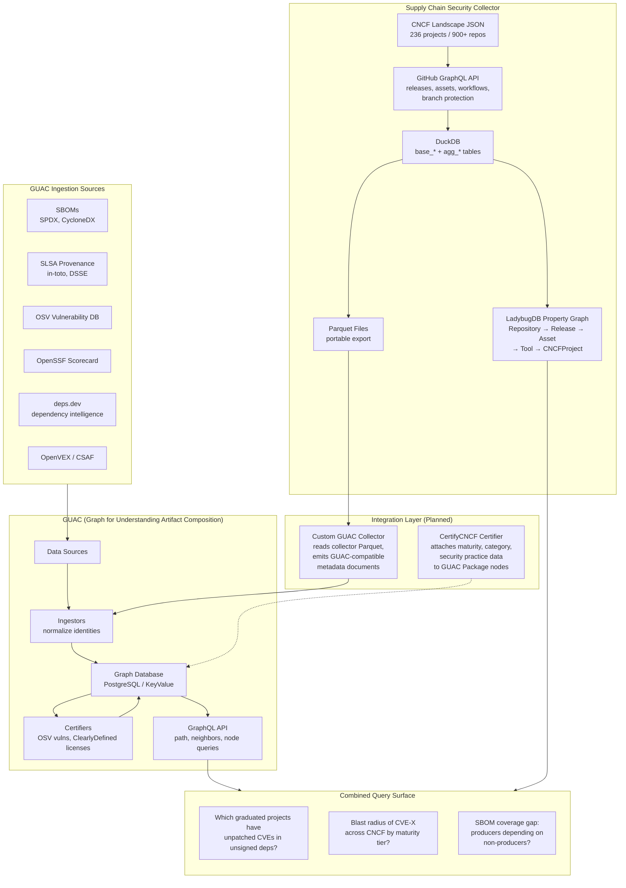

# GUAC Integration Strategy

## Deliverable 1: The GUAC + Collector Integration Story

### What GUAC Does

GUAC (Graph for Understanding Artifact Composition) aggregates software security metadata -- SBOMs, SLSA provenance, vulnerability data, Scorecards, and dependency intelligence -- into a unified graph database that normalizes identities and maps relationships between software artifacts. It answers "what depends on what, and what's vulnerable" by connecting packages, sources, artifacts, and vulnerabilities through a GraphQL API.

### What the Collector Does That GUAC Doesn't

The collector surveys the entire CNCF landscape (236 projects, 900+ repos) to detect *whether* supply chain security practices exist: does this project ship SBOMs, sign its releases, run vulnerability scanners in CI, use SLSA generators? It provides the organizational and maturity context -- which CNCF category, graduation status, and security audit history a project has -- that GUAC has no concept of.

### What GUAC Does That the Collector Doesn't

GUAC resolves the actual dependency graph: it knows that Package A version 1.2.3 depends on Package B version 4.5.6, which has CVE-2025-XXXXX, and that Package B's SLSA provenance traces to Builder C. The collector sees that a `.spdx.json` file exists in a release; GUAC reads it, parses every dependency, and connects them to known vulnerabilities and build provenance.

### The Combined Vision

**Together, we can answer questions that neither tool answers alone:**

1. **"Which graduated CNCF projects have unpatched critical CVEs in unsigned dependencies?"** -- The collector identifies which projects are graduated and which sign their releases. GUAC resolves the dependency tree and maps CVEs. Only together do you get: "Graduated project X depends on library Y (unsigned, no SBOM) which has 3 critical CVEs."

2. **"What is the blast radius across CNCF if a vulnerability is found in package Z?"** -- GUAC traces every project that transitively depends on Z. The collector tells you which of those projects are graduated (production-critical), which have no vulnerability scanning in CI, and which lack the SBOM tooling to even detect the problem.

3. **"Which CNCF projects *produce* SBOMs but *consume* dependencies that don't?"** -- The collector knows who produces SBOMs (16% of repos). GUAC can parse those SBOMs and check whether the declared dependencies themselves have SBOMs. This reveals the "SBOM coverage gap" -- projects doing the right thing but exposed because their dependencies are not.

### What's Built vs. What's Planned

| Component | Status | Description |
|-----------|--------|-------------|
| Collector: CNCF landscape scan | **Built** | Full pipeline: landscape JSON -> GitHub GraphQL -> DuckDB/Parquet |
| Collector: Security artifact detection | **Built** | SBOMs, signatures, attestations, SLSA, 40+ CI tools |
| Collector: LadybugDB property graph | **Built** | Graph export of repo/release/asset/workflow/tool relationships |
| Collector: Parquet export | **Built** | All base and aggregate tables exported as portable Parquet |
| GUAC: Graph database with GraphQL API | **Built** (by GUAC project) | Supports PostgreSQL, in-memory, and other backends |
| GUAC: SBOM/SLSA/OSV/Scorecard ingestion | **Built** (by GUAC project) | CycloneDX, SPDX, SLSA, OpenVEX, deps.dev |
| Integration: Collector Parquet -> GUAC | **Planned** | Custom collector/certifier to ingest collector metadata |
| Integration: Combined query surface | **Planned** | Join GUAC dependency graph with collector maturity/practice data |
| Integration: CNCF blast radius dashboard | **Planned** | Visualization combining both data sources |

## Deliverable 2: Integration Architecture Diagram

## Deliverable 3: Three Questions That Require Both Tools

### Question 1: "Which graduated CNCF projects have unpatched critical CVEs in unsigned dependencies?"

**Why it matters to CNCF:** Graduated projects are the ones running in production at scale. If their dependency tree contains unsigned, unvetted packages with known critical vulnerabilities, that is a material risk to the entire cloud-native ecosystem. This is the question a CNCF TOC member needs answered before a quarterly review.

**Which tool provides which piece:**

| Data Point | Source |
|------------|--------|
| Project maturity (graduated/incubating/sandbox) | Collector: `base_cncf_projects.maturity` |
| Whether the project signs its releases | Collector: `agg_repo_summary.has_signature_artifact` |
| Whether dependencies are signed | GUAC: traverse `IsDependency` edges, check for `HasSLSA` on each |
| Known CVEs in dependencies | GUAC: `CertifyVuln` nodes linked via OSV certifier |
| Whether the project even ships SBOMs (so GUAC can parse them) | Collector: `agg_repo_summary.has_sbom_artifact` |

**What the answer looks like:** A table: `| Project | Maturity | Signs Releases | Dep Count | Unsigned Deps | Deps w/ Critical CVEs |`. Filterable by maturity tier. Color-coded: graduated projects with unsigned vulnerable deps are red.

**Why neither tool alone can answer it:** The collector knows Kubernetes is graduated and signs releases but cannot see the dependency tree. GUAC can map the full dependency graph and CVEs but has no concept of "graduated" or "CNCF project" -- it only sees packages.

---

### Question 2: "What is the blast radius across the CNCF landscape if a critical vulnerability is found in package Z?"

**Why it matters to CNCF:** When log4shell happened, the question was not "which packages depend on log4j" -- it was "which critical infrastructure projects are affected, how mature are they, and do they have the tooling to detect and respond?" CNCF needs impact assessment at the *project* level, weighted by maturity and adoption.

**Which tool provides which piece:**

| Data Point | Source |
|------------|--------|
| Full transitive dependency graph from package Z | GUAC: `path()` and `neighbors()` queries on `IsDependency` edges |
| Which CNCF projects own the affected repos | Collector: `base_cncf_project_repos` join to `base_repositories` |
| Maturity tier of each affected project | Collector: `base_cncf_projects.maturity` |
| Whether affected projects have vulnerability scanning in CI | Collector: `agg_workflow_tools` (Snyk, Grype, Trivy, etc.) |
| Whether affected projects will even detect the issue | Collector: `agg_repo_summary.uses_sbom_ci_tool` |

**What the answer looks like:** A tiered blast radius report: "Package Z affects 47 CNCF projects. 12 are graduated. Of those 12, 3 have no vulnerability scanning in CI and 5 have no SBOM generation -- they will not detect this automatically." Visualized as a radial graph with GUAC dependency paths colored by collector maturity tier.

**Why neither tool alone can answer it:** GUAC shows the dependency fan-out but treats all consumers equally -- it has no concept of "this one is Kubernetes (graduated, critical) and this one is a sandbox experiment." The collector knows the maturity tiers but cannot trace dependency relationships.

---

### Question 3: "Which CNCF projects produce SBOMs but consume dependencies that don't -- and what are those blind spots?"

**Why it matters to CNCF:** SBOM adoption is the stated goal, but an SBOM is only as good as its coverage. A project that ships a CycloneDX SBOM listing 200 dependencies has done its part -- but if 150 of those dependencies have no SBOM of their own, the transitive supply chain is opaque. This is the "SBOM coverage gap" and it reveals where ecosystem-level investment should go.

**Which tool provides which piece:**

| Data Point | Source |
|------------|--------|
| Which projects produce SBOMs | Collector: `agg_repo_summary.has_sbom_artifact` or `agg_workflow_tools` with Syft/Trivy |
| What dependencies are declared in those SBOMs | GUAC: `HasSBOM` -> parse -> `IsDependency` edges |
| Whether each dependency has its own SBOM in GUAC | GUAC: check for `HasSBOM` on each dependency package |
| CNCF category and maturity of the producing project | Collector: `base_cncf_projects` |

**What the answer looks like:** A matrix: rows are CNCF projects that produce SBOMs, columns show total deps, deps with SBOMs, deps without, and the "coverage percentage." Sorted by gap size. The bottom of the list shows projects doing the right thing but most exposed to blind spots.

**Why neither tool alone can answer it:** The collector knows *who produces* SBOMs (16% of CNCF repos) but cannot read the SBOMs or check dependency coverage. GUAC can parse SBOMs and check dependency SBOM status but has no view of the CNCF landscape or which projects are strategically important.

## Deliverable 4: What's Real vs. What's Roadmap

### What Exists Today (Real)

**Collector side:**
- Complete CNCF landscape collection pipeline producing DuckDB + Parquet
- Detection of 40+ security tools and artifact patterns across 900+ repos
- LadybugDB property graph with Repository/Release/Asset/Workflow/Tool nodes
- Parquet export of all base and aggregate tables
- Markdown reports with per-project and per-maturity-tier statistics

**GUAC side:**
- Production-grade graph database with PostgreSQL backend
- Ingestion of SPDX, CycloneDX SBOMs; SLSA/in-toto attestations; OpenVEX; CSAF
- OSV certifier (auto-discovers vulnerabilities for ingested packages)
- OpenSSF Scorecard certifier
- ClearlyDefined license certifier
- Deps.dev integration for dependency intelligence
- GraphQL API with `path()`, `neighbors()`, `node()` queries
- Collectors for GitHub releases, S3, GCS, OCI images, local filesystem

### The Gap: What Needs to Be Built

GUAC does not ingest Parquet, CSV, or arbitrary tabular data. Its ingestion pipeline expects specific document formats: SPDX JSON, CycloneDX JSON, SLSA provenance JSON, in-toto attestations, Scorecard results, and VEX documents. The collector's output is relational data about *practices* (does this repo sign releases?), not *artifacts* (here is the actual SBOM).

**Three integration paths exist, from simplest to most powerful:**

#### Path 1: SBOM-Mediated Join (Simplest, No New Code in GUAC)

The collector already detects which repos have SBOMs and knows the download URLs (`base_release_assets.downloadUrl`). A new collector stage could:

1. Download the actual SBOM files from repos that have them
2. Feed those SBOMs into GUAC via `guacone collect files`
3. Use pURL (package URL) as the join key between collector repo data and GUAC package nodes
4. Query both systems and join results in DuckDB

**Glue needed:** A script that reads `agg_artifact_patterns` where `is_sbom = true`, downloads the SBOMs, and runs `guacone collect files` on them. Then a DuckDB query that joins collector Parquet with GUAC GraphQL results (fetched via API and loaded as JSON).

**What this gets you:** Questions 1-3 above become answerable with some manual query assembly.

#### Path 2: Custom GUAC Certifier (Medium Complexity)

Write a GUAC certifier in Go that:

1. Watches GUAC for new Package nodes
2. Looks up each package in the collector's Parquet data (via pURL -> `nameWithOwner` mapping)
3. Attaches custom metadata: CNCF maturity, security practice flags, category
4. Uses GUAC's `CertifyGood`/`CertifyBad` or a custom predicate

**Glue needed:** A Go module implementing the GUAC certifier interface. A pURL-to-GitHub-repo mapping table. The certifier reads collector Parquet files (DuckDB can read Parquet natively; Go has Arrow libraries).

**What this gets you:** CNCF context lives inside GUAC's graph. Queries like "find all graduated projects with vulnerable deps" become single GraphQL queries.

#### Path 3: Bidirectional Graph Federation (Most Powerful, Most Work)

Both systems already have graph representations (GUAC's native graph, collector's LadybugDB graph). Build a federation layer:

1. Collector's LadybugDB graph exports to GUAC-compatible format
2. GUAC's Package nodes link to collector's Repository nodes via pURL/`nameWithOwner`
3. A unified query layer spans both graphs

**Glue needed:** Schema alignment between LadybugDB node types and GUAC ontology nouns. A federation proxy or a shared graph backend. Significant engineering.

**What this gets you:** Full bidirectional traversal. "Start from a CVE, traverse to all affected packages, traverse to all CNCF repos that depend on them, check their maturity and security practices" -- in one query.

### Recommended Starting Point

**Path 1 is the right first step.** It requires no changes to GUAC, no Go code, and can be implemented as a new stage in the collector's existing Node.js pipeline. The collector already knows which repos have SBOMs and where they are. Downloading them and feeding them to GUAC is a weekend project. The combined query requires DuckDB + GraphQL, which is awkward but functional -- and it proves the value before investing in deeper integration.

Path 2 becomes worthwhile once the combined queries demonstrate value to the CNCF community and the manual join becomes the bottleneck.
