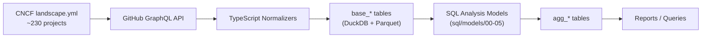

# CNCF Supply Chain Security Presentation — Execution Plan

## Panel Consensus

All four panelists converged on these points:

1. **The tool answers a question nobody in the CNCF can answer today** — "across all ~230 projects, who is actually shipping SBOMs, signing releases, and running security tools?"
2. **TOC Issue #1709** is the institutional anchor — it describes exactly this initiative
3. **TAG Security is the contribution target**, not a new standalone project
4. **Frame as measurement infrastructure**, not a report card — never shame projects
5. **Run the full landscape before presenting** — 3-project data demonstrates capability but lacks weight
6. **Position as complementary** to CLOMonitor, Scorecard, and GUAC — not competing

## Tension Identified and Resolved

**Tension:** The Security Practitioner discovered that the GraphQL query fetches the 5 oldest releases (`last: 5, orderBy: DESC`) instead of the 5 newest. This means the "0% SBOM adoption" finding is an artifact of looking at 2014-era releases. Kubernetes' modern releases DO include SBOMs and signatures.

**Resolution:** Fix the query to `first: 20, orderBy: DESC` (20 most recent releases), re-run all test data, then run the full landscape. This is a blocker — the presentation data must be correct.

---

## Pre-Presentation Blockers (do these first)

### 1. Fix the release pagination bug
```
src/graphql/GetRepoDataExtendedInfo.graphql line 64:
  BEFORE: releases(last: 5, orderBy: { field: CREATED_AT, direction: DESC })
  AFTER:  releases(first: 20, orderBy: { field: CREATED_AT, direction: DESC })
```
One-line fix. Then re-run tests to verify.

### 2. Run the full CNCF landscape
```bash
npm start   # ~230 projects, will take a while
```
This produces the real numbers. Everything in the presentation depends on this data.

### 3. Generate the report
```bash
npm run report -- --database output/cncf-full-landscape/current/database.db
```

---

## Presentation Structure (Lead's Framework)

### Opening (30 seconds) — "Why now"

- TAG Security published Supply Chain Security Best Practices v2
- TOC Issue #1709 calls for ecosystem-wide supply chain measurement
- Nobody has measured whether CNCF projects follow their own guidance
- We built the measurement infrastructure. Here's what we found.

### Section 1: "Here's an example answer to a question"

**Lead question:** "What percentage of graduated CNCF projects actually ship SBOMs and signed releases?"

Show `agg_executive_summary` query. Show the numbers. Then drill into the gap:

**The CI-vs-release disconnect:** Many projects run security tools in CI (cosign, trivy, CodeQL) but produce zero verifiable artifacts in their releases. The tooling is there — the last mile is not.

**Secondary questions** (have ready, don't necessarily show all):
- "Which security tools has the ecosystem converged on?" (`agg_tool_summary`)
- "Do CNCF security projects use their own tools?" (cosign on Sigstore, syft on Anchore)
- "Does Jaeger's SECURITY-INSIGHTS.yml match reality?" (the say/do gap)

### Section 2: "Here's where the data came from"

Show the pipeline diagram (Mermaid):



Then show a live query — open DuckDB, run SQL, get results. This proves it's real, not slides.

### Section 3: "Here's how the data got into the database"

**What is measured (directly observed):**
- Release asset filenames matched against known patterns (SPDX, CycloneDX, .sig, .asc, .bundle)
- Workflow YAML scanned for 20+ tool names via Full-Text Search
- SECURITY-INSIGHTS.yml declarations parsed from structured YAML

**What is NOT measured:**
- Whether detected tools execute successfully
- Whether artifacts are valid or complete
- Container registry artifacts (OCI signatures, attached SBOMs)
- Non-GitHub CI systems (Prow, Jenkins, GitLab CI)

**Honest framing:** "This measures observable supply chain security hygiene — the presence of tools, artifacts, and declarations. Not effectiveness. A leading indicator, not a compliance certification."

### Section 4: "Here's where we plan to contribute"

**The contribution slide:**

| What | Where | Status |
|------|-------|--------|
| Detection methodology + landscape assessment | TAG Security work item | Proposal ready |
| Supply chain behavioral checks | CLOMonitor extension | Design spec drafted |
| Open dataset (Parquet) | CNCF community resource | Data available now |

**The ask:**

> "We want to contribute this methodology and dataset to TAG Security as a recurring landscape assessment. We need two things:
> 1. A sponsor — someone in TAG Security willing to champion this as a work item
> 2. Signal on scope — full landscape quarterly, or start with graduated projects only?"

**Precedents to cite:**
- DevStats — started as a personal project, now official CNCF infrastructure
- OpenSSF Scorecard — defined the methodology first, built the tool around it
- TAG Security's own Best Practices paper — "you wrote what to do; we built how to measure it"

### Section 5: Q&A

**Prepared answers for likely questions:**

| Question | Answer |
|----------|--------|
| "Kubernetes shows 0 workflows — is that a bug?" | "No, it's accurate. Kubernetes uses Prow, not GitHub Actions. This is a measurement boundary we're transparent about. Extending to Prow is on the roadmap." |
| "Why not just use Scorecard/CLOMonitor?" | "Complementary. Scorecard checks development practices. CLOMonitor checks governance. We check whether supply chain artifacts actually exist in releases. Different data source, different signal." |
| "How current is the data?" | "Point-in-time snapshot. Designed to run on a schedule. Nightly/weekly via GitHub Actions is the plan." |
| "What about OCI registry signatures?" | "Known gap. Container registry analysis (cosign verify, crane) is the highest-priority next detection. Today we cover GitHub release assets only." |

---

## Diagrams to Prepare

### 1. Data Pipeline (Section 2)
Mermaid flowchart — landscape.yml → GraphQL → normalizers → DuckDB → SQL models → agg tables → outputs

### 2. Security Gap Visualization (Section 1)
2x2 matrix: CI tooling (x) vs Release artifacts (y). Shows projects clustered at bottom-right (have CI tools, no release artifacts).

### 3. Contribution Vision (Section 4)
Mermaid flowchart — Today (manual) → Near-term (scheduled GitHub Action → trend DB → dashboard/CLOMonitor/TAG reports) → Extension points (new detectors, new data sources)

---

## What NOT to Show

- Raw GraphQL responses or `raw_*` tables
- Empty tables (branch protection, si_attestations)
- Schema details or column lists
- TypeScript code internals
- More than 2 minutes on "how to extend"
- Comparisons framed as competition with CLOMonitor/Scorecard

---

## Execution Checklist

- [ ] Fix `last: 5` → `first: 20` in GetRepoDataExtendedInfo.graphql
- [ ] Re-run `npm test` to verify fix
- [ ] Run full landscape (`npm start`)
- [ ] Generate report from full landscape data
- [ ] Review report for surprising findings (these become the presentation stats)
- [ ] Render 3 Mermaid diagrams
- [ ] Prepare 3-4 live DuckDB queries with expected outputs
- [ ] Draft the "ask" slide
- [ ] Rehearse the 5-minute demo flow
- [ ] Proactively address Kubernetes/Prow edge case in speaker notes
